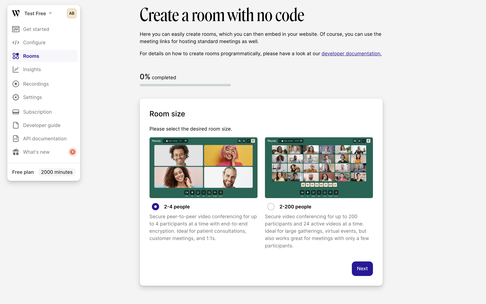

# Using “Create a room”

### Creating rooms

The fastest way to get started with creating Whereby Embedded rooms is through the “Create a room” flow, which can be launched from the “Get started” and “Rooms” sections in your Whereby Embedded account's Dashboard.

The wizard consists of 4 self-explanatory steps:

1. Pick your preferred room size: small or large;
2. Set up recording;
3. Set up streaming;
4. Set an optional room prefix and an expiration date;

And that's all there is to it!&#x20;

The Room Overview page that follows gives you a view at a glance of what you have configured, features handy [host and participant links](https://docs.whereby.com/user-roles-and-privileges), and generates a code snippet you can include in your website.&#x20;

If you want to review these room details again at a later point in time, you can find an overview of all rooms you've created (incl. demo rooms and rooms generated through the API) in the new “Rooms” section that's linked from the sidebar.&#x20;


While the “Create a room” flow is perfect for getting started, and is probably sufficient if you only need to create a handful of meeting rooms, we recommend looking into the [REST API documentation](https://whereby.dev/http-api/) to generate rooms on-the-fly, and unlock the full power of Whereby Embedded.


### Deleting rooms

For many scenarios, it makes sense to create rooms to be used for a limited time or even just a single meeting, after which the rooms should be deactivated. With each room having a unique URL and a limited lifespan, there's no need to worry about meetings conflicting or rooms being used for other purposes after the intended session.&#x20;

When creating a room through the “Create a room” flow, you have define a “Room end date”. The room will automatically be deleted within 24 hours of this date.

Currently, we don't support deleting a specific room through our dashboard, but you can [delete a room at any time using the API](https://whereby.dev/http-api/#/paths/\~1meetings\~1{meetingId}/delete) as described in the API reference documentation.
