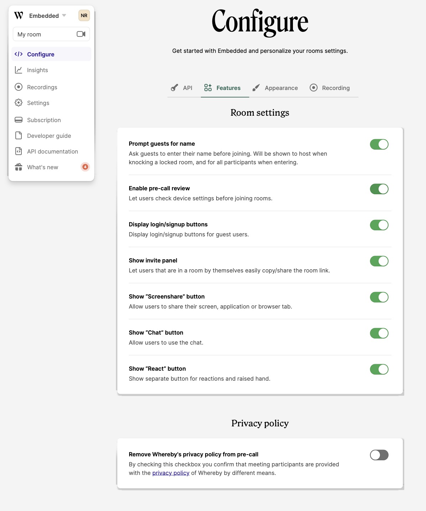

# Dashboard preferences

The feature preferences can be found under "**Configure**” **→** “**Features**”. Any adjustments made here will be applied to all your rooms, unless overridden by specific [URL parameters](using-url-parameters.md) added to the meeting URL.

### Whereby Privacy Policy

From the Features tab, you can choose to remove the mention of Whereby's privacy policy during the pre-call portion. By checking the box you confirm that you have provided our policy by other means. You'll find our policy here:



