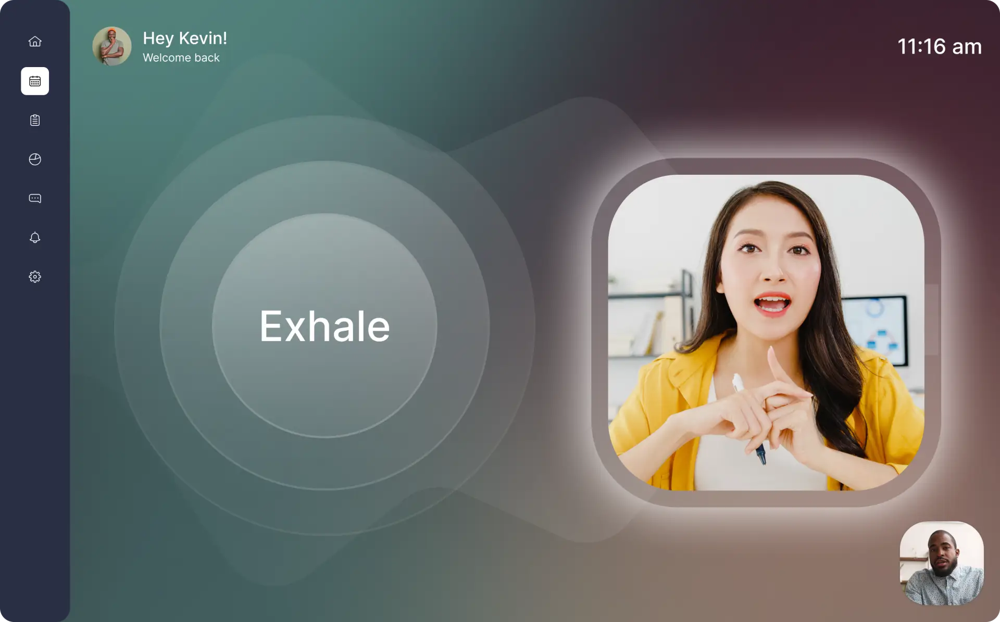
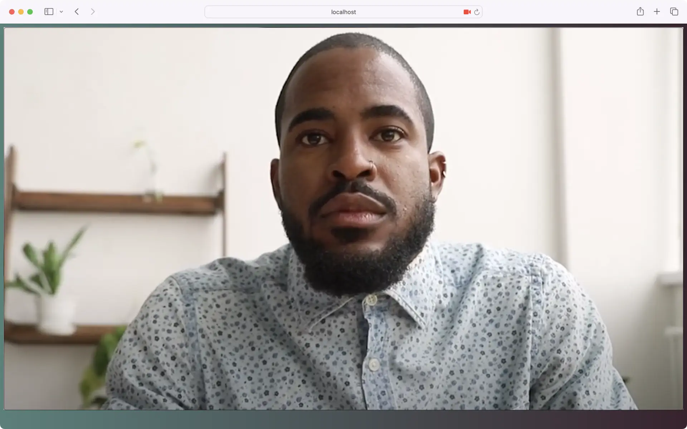
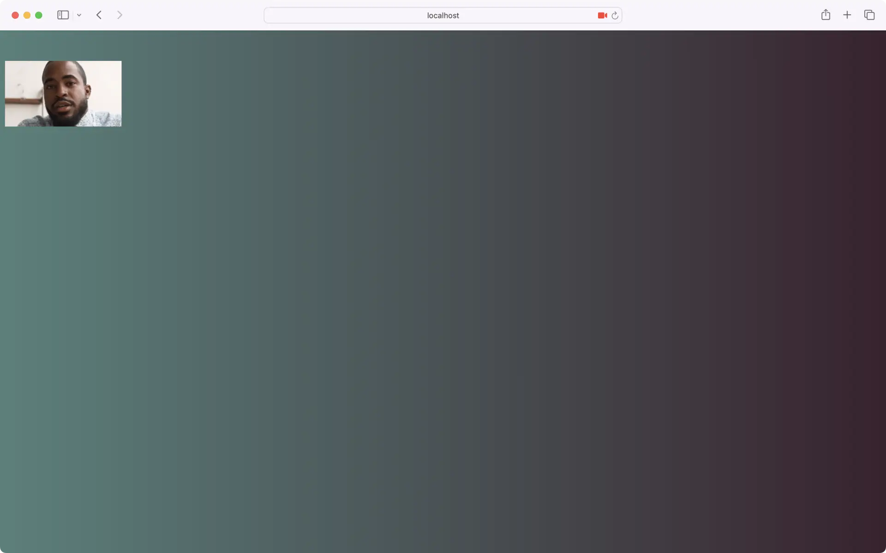
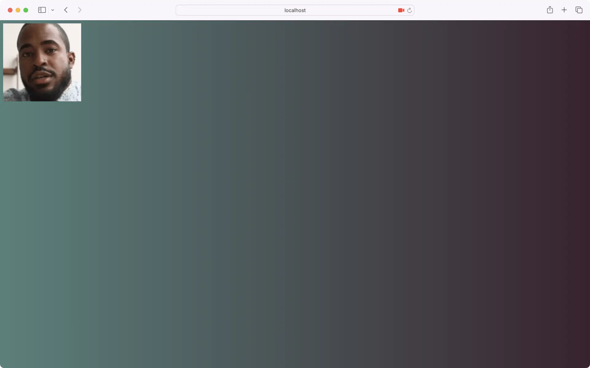
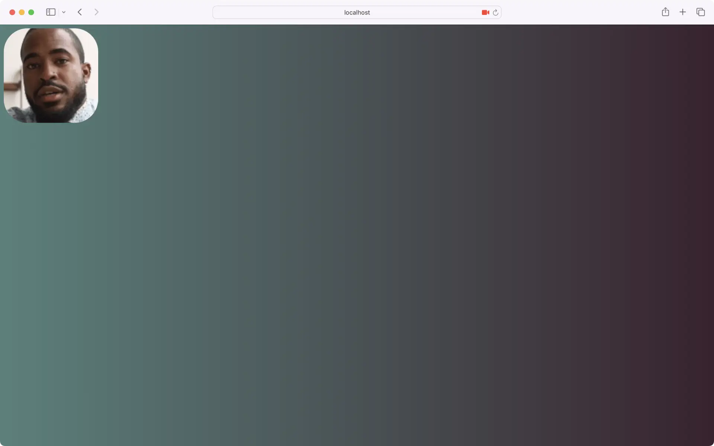
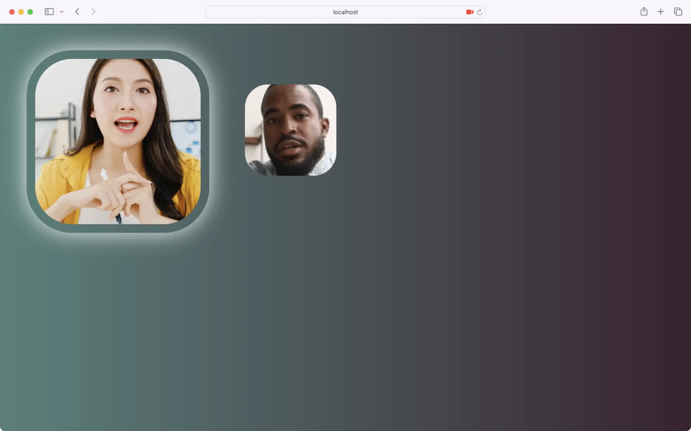

# Custom Video Tiles with React

## Intro and getting started

One advantage of the Whereby Browser SDK is ease of customization. You can customize your video calling UI right down to the video tiles using what you already know: CSS, JavaScript, and React.

In this tutorial, you'll create a pair of video tiles. Before starting, you'll need a [Whereby Embedded](https://whereby.com/information/embedded) account. Once you have your account, create a meeting room using your account dashboard or Whereby's [REST API](https://docs.whereby.com/whereby-101/creating-and-deleting-rooms). You can leave the room unlocked for development purposes.


You can get started on Whereby for free with 2,000 participant minutes each month — perfect for trying our features.


This tutorial assumes:

* You're familiar with React, Node, and either [npm](https://www.npmjs.com/) or [Yarn](https://yarnpkg.com/).
* You've already set up a React project. If not, [Vite](https://vitejs.dev/guide/) or [Parcel](https://parceljs.org/recipes/react/) can get you up-and-running quickly.
* You've read our earlier post, [How To Add Video Conferencing to Your Web App Using the Whereby Browser SDK](https://whereby.com/blog/how-to-add-video-conferencing-to-your-web-app-using-the-whereby-browser-sdk/).

You'll need this background to understand some of the code examples here.

### What we're creating <a href="#whatwerecreating" id="whatwerecreating"></a>

Whereby is well-suited to coaching, telehealth, remote classrooms, and virtual meetings. We'll use the Whereby Browser SDK and CSS to create video tiles for a remote 1-to-1 coaching business, BreatheCoaching. The image below illustrates what we're going to build.

<figure><figcaption></figcaption></figure>

### Create a Participant component <a href="#createaparticipantcomponent" id="createaparticipantcomponent"></a>

Start by adding a `Participant` component to your project. This is the component we'll use to display each participant's video.

```tsx
import React from "react";

const Participant = (props) => {

  /*
   * In the parent component: 
   * <Participant {...localParticipant} {...components} />
   */
  const {
    VideoView,
    stream
  } = props;

  return (
    <div>
      {stream && 
        <VideoView mirror stream={stream} />
      }
    </div>
  )
}

export default Participant;
```

`Participant` expects a `VideoView` component prop from its parent. `VideoView` requires also a `stream` prop value — the `stream` property of either a [`LocalParticipant`](https://docs.whereby.com/reference/react-hooks-reference/types#localparticipant-less-than-object-greater-than) or [`RemoteParticipant`](https://docs.whereby.com/reference/react-hooks-reference/types#remoteparticipant-less-than-object-greater-than) object. Pass the `stream` prop of `Participant` along to `VideoView`, as shown above.

At this point, the video tile should fill your entire browser, as in Figure 2. By default, the `VideoView` component expands to fit the width of its container. Let's constrain its width with some CSS.

<figure><figcaption><p>Figure 2</p></figcaption></figure>

### Managing the video tile's dimensions <a href="#managingthevideotilesdimensions" id="managingthevideotilesdimensions"></a>

Add a `Participant.css` file to your project. Import it into the `Participant` component file as shown below.

```tsx
import React from "react";
import 'Participant.css';
```

Add a `className` attribute with a value of `participant` to the containing `div` element. You'll use this attribute value as the selector in your CSS.

```tsx
//…

return (
  <div className="participant">
    {stream && 
      <VideoView stream={stream} />
     }
  </div>
)
```

Since the design specs for BreatheCoaching require square video tiles with rounded corners, set the `width` property for the `.participant` class. Use the [`aspect-ratio`](https://developer.mozilla.org/en-US/docs/Web/CSS/aspect-ratio) CSS property to enforce square dimensions.

```css
:root {
  --localParticipantWidth: 200px;
}

.participant {
  aspect-ratio: 1;
  width: var(--localParticipantWidth);
}
```

Now our video tile is 200 pixels wide by 200 pixels tall. Our video _source_ however, is only 112.5 pixels tall (Figure 3).

<figure><figcaption><p>Figure 3</p></figcaption></figure>

Videos maintain their aspect ratio regardless of the dimensions of the `video` element or its containing ancestors. To resolve this, use the [`object-fit`](https://developer.mozilla.org/en-US/docs/Web/CSS/object-fit) CSS property and the `cover` value.

```css
.participant > video {
  object-fit: cover;
}
```

Using `object-fit: cover` causes the browser to scale the video source so that it fills the container, but maintains its aspect ratio. Your video tile should now resemble Figure 4.

<figure><figcaption><p>Figure 4</p></figcaption></figure>

### Rounding the corner <a href="#roundingthecorner" id="roundingthecorner"></a>

Our design also calls for rounded video tile corners. Add a `border-radius` declaration to the `.participant` rule set, along with `overflow: hidden`. The latter rule ensures that the corners of the video don't extend past its container.

```css
.participant {
  aspect-ratio: 1;
  width: var(--localParticipantWidth);
  border-radius: 25%;
  overflow: hidden;
}
```

Your video tile should now resemble Figure 5.

<figure><figcaption><p>Figure 5</p></figcaption></figure>

Although the local and remote participant tiles are different sizes, there's a lot of overlap in their appearance. Instead of creating a separate component, let's add some code to support a remote participant variation.

### Same component, different look <a href="#samecomponentdifferentlook" id="samecomponentdifferentlook"></a>

Each participant object contains a property named `isLocalParticipant`. For remote participants, the value of this property is always `false`. Use this property to conditionally add a `remote` class to the remote participant tile. First, update the destructuring assignment to extract `isLocalParticipant` from `props`.

```tsx
 const {
  VideoView,
  stream,
  isLocalParticipant
} = props;
```

Then conditionally add a `remote` class to the containing `div`.

```tsx
return (
  <div className={`participant ${ !isLocalParticipant ? '' : 'remote'}`>
    {stream && 
      <VideoView stream={stream} />
     }
  </div>
)
```


**Note:** Using the ternary operator is fine for tutorials. For production-ready projects, consider the [classnames](https://www.npmjs.com/package/classnames) package instead.


Finally, add a `.remote` rule set to `Participants.css`. Override the `width` property value from `.participant` and add a transparent border. Use the [`box-shadow` property](https://developer.mozilla.org/en-US/docs/Web/CSS/box-shadow) to add the halo.

```css
:root {
  --localParticipantWidth: 200px;
  --remoteParticipantWidth: 400px; /* Add a --remoteParticipantWidth custom property */
}

//…

.remote {
  width: var(--remoteParticipantWidth);
  border: 1.2rem solid transparent;
  box-shadow: 0 0 2rem 0.5rem #fff;
}
```


**Note:** You can also use the [`filter`](https://developer.mozilla.org/en-US/docs/Web/CSS/filter) property and the `drop-shadow()` filter to create the halo effect.


Your remote participant tile should look a bit like Figure 6.

<figure><figcaption><p>Figure 6</p></figcaption></figure>

Put it together with the rest of our UI design, and you can launch BreatheCoaching in no time.
