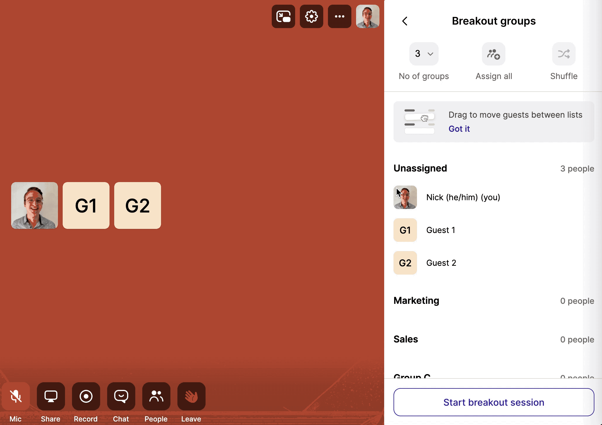
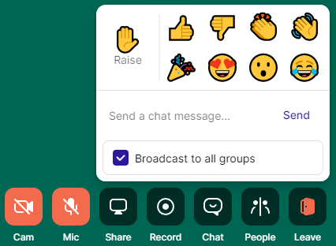
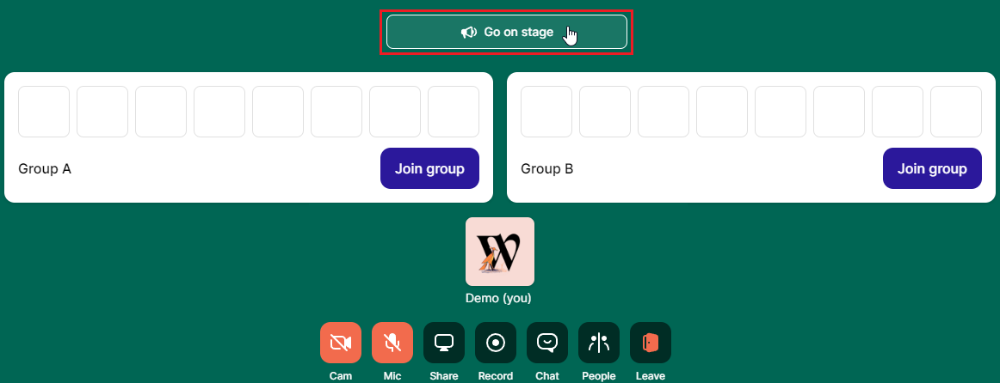
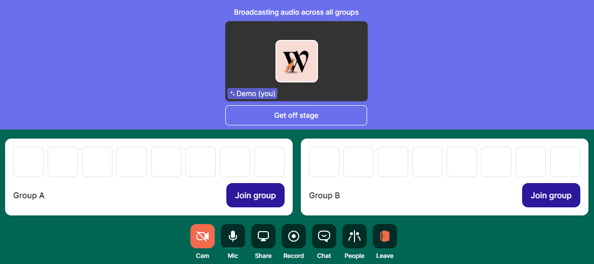

# Using Breakout Groups

Once you have Breakout Groups [implemented](../customizing-rooms/breakout-groups-with-embedded.md), it will be important that Hosts know how to use them. For this, we have a series of guides that all Hosts should review before getting started:



1. Hover over the 'people' button to start your breakout groups\
   
2. The main room can hold up to 200 people. You can split these people into a maximum of 20 groups and can change the group names to suit any situation.\
   
3. Drag and drop participants to assign groups, or shuffle everyone to save time and encourage connection.
4. When you're ready, select "Start breakout session"



1. Before selecting start, drag and drop participants names to assign them to a group.
2. Or, select "Assign all" to have Whereby do the work for you. You can press "Shuffle" to re-assign the groups until you're happy with the allocation.
3.  Leave your participants in the unassigned section to allow them the freedom of choice.\

    <figure><figcaption></figcaption></figure>



When leading group sessions, it can be helpful to communicate with everyone at once to remind them of topics, encourage discussion, or bring them back to the main room.&#x20;

You can broadcast to all groups via chat or by getting on stage. Messages sent within a breakout group will only be seen by the people in that group.

1.  Check the "Broadcast to all groups" box in the chat to send everyone a written message.

    
2.  Select "Go on stage" to communicate with everyone via audio.\

    <figure><figcaption></figcaption></figure>
3.  While "on stage" all groups will be able to hear you. You can get "off stage" to stop broadcasting to all groups.\

    <figure><figcaption></figcaption></figure>



\
