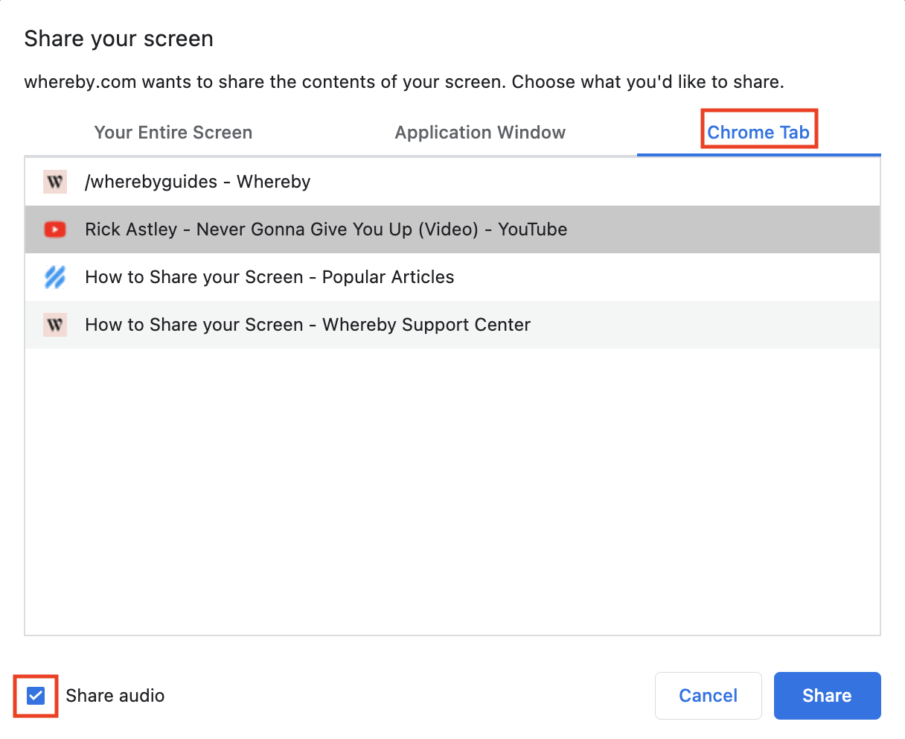

# Screen Sharing

Screen sharing is a great way to share content to other/hosts participants in the room.

To keep an optimal level of performance in the room, screen sharing will broadcast from 1-5 FPS (frames per second) by default, and up to 1080p based on network and CPU restraints.

Depending on the browser being used, there will be different options for what can be shared.


Screen sharing on Mobile (both phone and tablet) devices is not currently available.&#x20;


## Setup and Management

As the platform holder, there are few options you have for managing the available screen sharing feature.

* Enabling screen sharing for all rooms via a [dashboard preference](../customizing-rooms/dashboard-preferences.md)
* Enabling screen sharing on a per room/user basis with a [URL parameter](../customizing-rooms/using-url-parameters.md#screenshare-less-than-on-or-off-greater-than)
* Listening for the [screen sharing event](../embedding-rooms/in-a-web-page/using-the-whereby-embed-element.md#listening-to-events) with our embed element to facilitate in app messages or notifications
* Using the [browser method](../embedding-rooms/in-a-web-page/using-the-whereby-embed-element.md#sending-commands) for stopping/starting screen sharing


Allowing the use of "[Picture in Picture](https://docs.whereby.com/customizing-rooms/using-url-parameters#pipbutton-off)" can be helpful for users that want to screen share content and view others within the room


## Browser features



You can share an image of your entire screen. If you have multiple monitors, you can also select which one you'd like to show.

If you select the "Window" section, you can select a specific application like Word or Chrome that you want to share.&#x20;

lastly, you can use the Chrome Tab option if you only want to share one tab from your Browser.

<figure><figcaption></figcaption></figure>



Firefox allows for the sharing of an entire screen, or of an app window. Options are not divided into sections.

<figure><figcaption></figcaption></figure>



SafariFirefox allows for the sharing of an entire screen, or of an app window. When selecting the "Share Window" option, you'll hover your mouse over and click the window you'd like to share.

<figure><figcaption></figcaption></figure>



## Screen sharing with audio

Sharing computer audio is possible while screen sharing and using Chrome or Chromium browsers.&#x20;

Depending on the sharing option selected and the operating system, a checkbox that says "Share Audio" will be present that you can check to share audio.



**macOS**

On macOS, users are only able to share a specific Chrome tab. Sharing audio for the entire computer or a specific application window isn't possible at this time due to browser/operating system permissions.On Windows machines, you'll have the option to share audio from any Chrome tab, and you can also share the audio for your Entire Screen.

<figure><figcaption></figcaption></figure>



On Windows machines, users have the option to share audio from any Chrome tab or share the audio for the Entire Screen.


Sharing the audio of the entire screen that contains a Whereby room will cause an echo effect. To prevent this issue from happening, try sharing the audio of a Chrome tab or a separate monitor instead.


<figure><figcaption></figcaption></figure>


