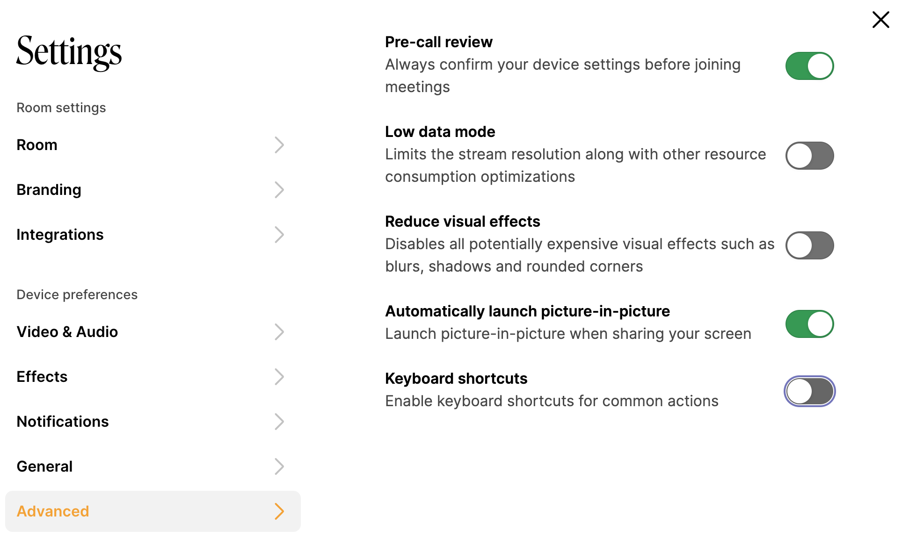

# Accessibility

For more informations and requirements for the 2.1 guideline, you can review the W3C site:



Download a copy of the latest Whereby Embedded VPAT:



### Features & Usage

#### Keyboard navigation

All parts of the Whereby UI are reachable using the **tab key**. Flyout menus can be triggered using the **space bar** (or a long press on mobile)

Users can also disable our single-key shortcuts if they prefer, as these might interfere with other shortcuts users have set.

<figure><figcaption>
Keyboard shortcuts toggle can be disabled in settings->advanced
</figcaption></figure>

Below are the shortcuts and what they do:

* **V** **-** Enable/disable your camera
* **M** **-** Enable/disable your mic
* **Space** **-** Hold to toggle mute or unmute
* **C** **-** Open the chat window
* **F** **-** Show/hide the toolbars
* **Shift + L** **-** Lock or unlock the room
* **P** **-** Show or hide Picture in Picture
* **Shift + P** **-** Pop out or pop in your own video
* **Shift + S** **-** Start or stop sharing your screen
* **Double-click a video cell** **-** Maximize or Exit maximize view
* **Shift + Double-click a video cell** **-** Add or remove spotlight

#### Screen readers & Assistive Technology

Markup clearly defines the function of different UI elements and includes labels where needed, enhancing navigation for screen readers.

Aria-live attributes are used to define how screen readers should prioritise incoming chat messages and important status messages.

Viewport zooming restrictions are removed, allowing unrestricted zooming on mobile devices.

#### Live Captions

Our Live Captions, or closed caption, feature is an accessibility feature designed for those with impaired hearing. You can learn more on how the feature works and how to enable it in our guide here: [Live Captions](../../whereby-product-features/live-captions.md)
