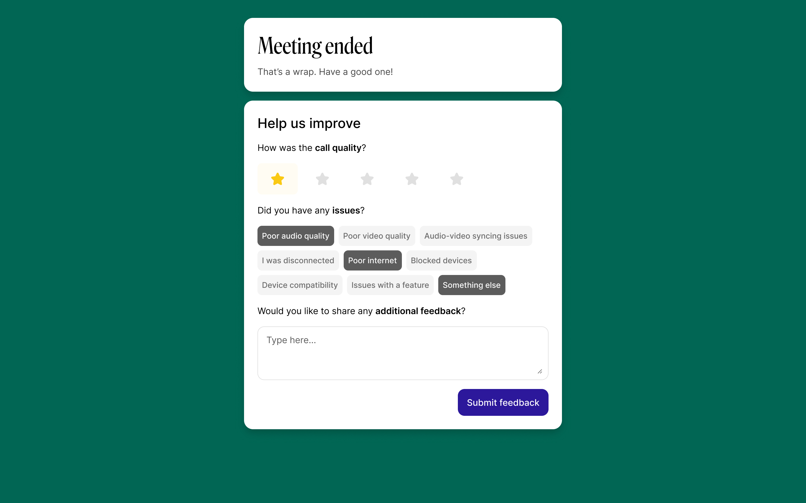

# Session Ratings

Session Ratings allow you to understand the quality of your sessions through quantitative and qualitative feedback from your participants. This is visually represented within your Insights Dashboard.


Session Ratings is currently in closed Beta and available to selected customers only. Email us at [embedded@whereby.com](mailto:embedded@whereby.com) to join our pilot program (terms and conditions apply)


### How does it work?

After a session ends, participants can give feedback in three simple steps:

1. Give the call a quality rating from 1 to 5 stars
2. If they gave a low rating, they can select what problems they experienced
3. If they gave a low rating, they can add more details in a comment box (this option is turned off by default)

<figure><figcaption></figcaption></figure>

You can see all of this feedback in your Whereby Insights dashboard, where you'll find aggregated ratings and can also deep-dive into specific sessions.

### **Setup**

Session Ratings is turned off by default. To enable Session Ratings across all sessions, navigate to the “Configure” → “Features” section of your customer portal:

<figure><figcaption></figcaption></figure>

It is currently not possible to enable the feature on a per room basis.

Once enabled, an additional tick box allows for more qualitative feedback from low scoring users.

### **Known limitations**


The default setup is HIPAA compliant, but if customers decide on using the freeform text field, they could store personal identifiable information. We have no way of redacting this from the freeform.

