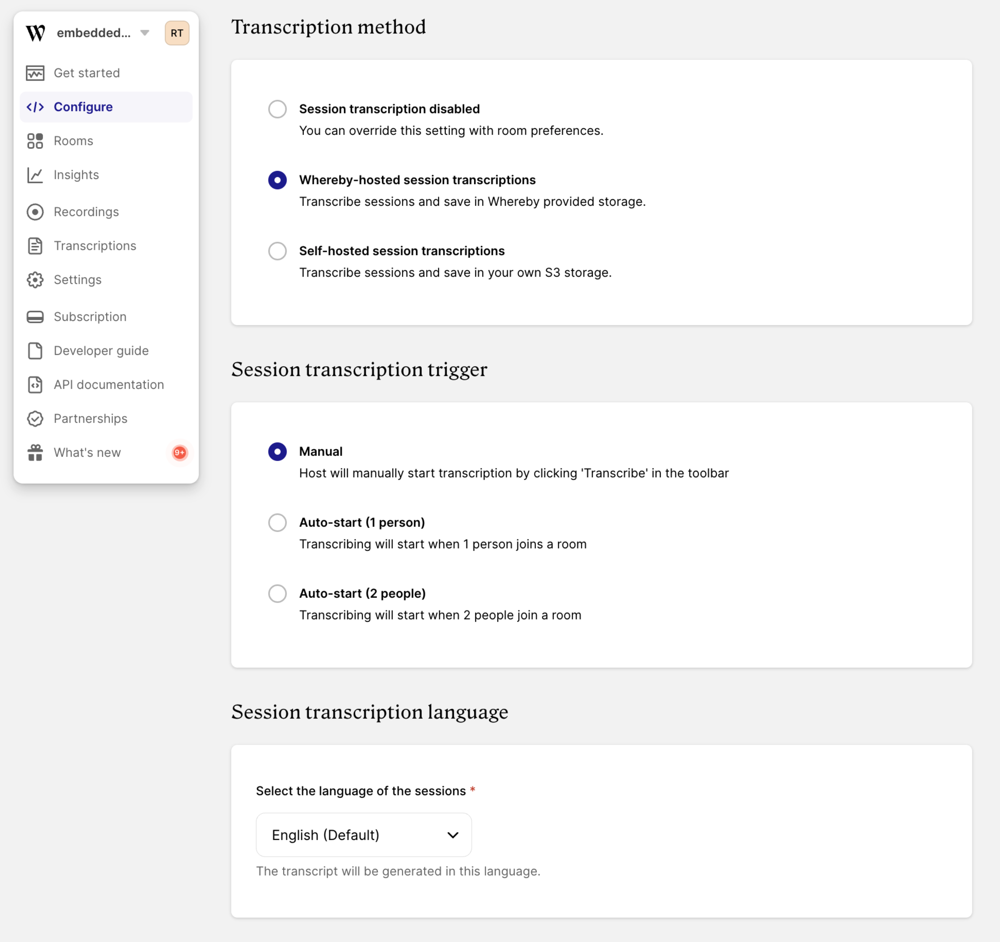

# Session Transcription


Session Transcriptions is currently in Public Beta.



_What is an unmuted participant minute?_ This is calculated using the number of participants who are unmuted during a call. For example, a 60 minute meeting containing 2 people who are unmuted for the whole meeting would use 120 unmuted participant minutes. Alternatively, a 60 minute meeting with 3 participants, where only 2 participants were unmuted and the third participant was muted for the whole meeting, would also use 120 unmuted participant minutes. From the moment a participant is unmuted, this usage counts towards the number of unmuted participant minutes, even if they do not actively talk or engage on the call.


Session transcripts are created by live streaming Whereby session audio in real time. After the session is finished they are saved as text files accessible from the dashboard or via [the API](../../reference/whereby-rest-api-reference/transcriptions.md). You can use the transcripts as a standalone resource (eg. for compliance purposes) or send to an external service for post processing (eg. to derive key topics or create a session summary).&#x20;

## Storage options

We offer two storage options for the Session Transcription feature.&#x20;

### Whereby-provided storage

By choosing Whereby-provided storage for session transcriptions, you can can take full advantage of Whereby's session transcriptions without the need to configure and maintain your own Amazon S3 bucket for transcription storage.

You can view, delete or download these transcriptions either through the "Transcriptions" page in Whereby customer portal or using our [Transcriptions API](../../reference/whereby-rest-api-reference/transcriptions.md).

### Your Amazon S3 bucket

You may also choose to store session transcriptions in an Amazon S3 bucket owned and managed by you. This is more technical to set up, but may suit your business needs better if you already own and manage Amazon S3 storage.

## Setup

You can enable and configure Session Transcription globally for your account, or individually for each room. All transcripts can be downloaded manually through the dashboard, or programmatically with the API requests.

### Global configuration


When you enable Session Transcription globally through the dashboard, these settings become the default for all rooms and sessions. Enabling Session Transcription globally will result in all sessions being transcribed, including sessions in rooms created previously. You can override these global settings by specifying the transcription on a [per room](session-transcription.md#per-room-configuration) basis


If you want to use Session Transcription for all your sessions, you can enable it globally for your account. Go to “Configure” → “Transcription” section of your customer portal and choose either "Whereby-hosted session transcriptions" or "Self-hosted session transcriptions" options. Then choose the trigger and the main language of your sessions.

<figure><figcaption><p>Global configuration of Session Transcription</p></figcaption></figure>

To set up your own self-hosted storage option for Session Transcription you will need AWS S3 credentials. Please refer to the guide provided for self-hosted recordings [here](../recording-with-embedded/cloud-recording.md#setup-and-information-in-s3) for further information on obtaining these credentials from AWS directly.

You can choose between the following transcription triggers:

* **Manual**\
  The host will start and stop the transcription manually.&#x20;
* **Auto-start (1 person)** \
  Transcription will start when the first person joins and end when the last person leaves.&#x20;
* **Auto-start (2 people)**\
  Transcription will start when 2 people join a room and end when the last person leaves.


### Per room configuration

If you want to use Session Transcription for some of your sessions, or if you need a different configuration for some of the sessions, you can configure Session Transcription individually for the room. Room parameters will override the global Session Transcription settings.&#x20;

To do so, create the room with [POST /meetings](../../reference/whereby-rest-api-reference/meetings.md) request and specify the transcription options of your choice:&#x20;

```json
"liveTranscription": { 
    "language": "en", 
    "startTrigger": "automatic",
    "destination": {
        "provider": "whereby"
    }
},
```

In the `"destination.provider"` option you can choose between `"whereby"` and `"s3"`. Please refer to the [POST /meetings](../../reference/whereby-rest-api-reference/meetings.md) API reference docs for further `"destination"` configuration options.

For the `"startTrigger"` option you can choose between `"manual"`, `"automatic"` or `"automatic-2nd-participant"` triggers.&#x20;


It is not possible to combine multiple transcription triggers. If you choose one of the automatic triggers, the host will not be able to stop the transcription during the session.&#x20;


When the session is transcribed, the participants see a notification circle in the top-left meeting status bar:

<figure><figcaption><p>Red circle in the top-left panel indicates session transcription in progress.</p></figcaption></figure>

For the `"language"` option please refer to the [list of supported languages](session-transcription.md#supported-languages).

### Supported languages

Session Transcription generates a transcript in the specified language. You need to declare the language used by your session participants in advance - in the [global configuration](session-transcription.md#global-configuration) or [per room](session-transcription.md#per-room-configuration) with POST /meetings request. After the room is created, you cannot change the language of the Session Transcription.&#x20;

<details>

<summary>Session Transcription supported languages</summary>

* Catalan (ca)
* Chinese (Mandarin, Simplified) (zh)
* Chinese (Mandarin, Traditional) (zh-TW)
* Czech (cs)
* Danish (da)
* Dutch (nl)
* English (en)
* Finnish (fi)
* French (fr)
* German (de)
* Greek (el)
* Hindi (hi)
* Indonesian (id)
* Italian (it)
* Japanese (ja)
* Korean (ko)
* Latvian (lv)
* Malay (ms)
* Norwegian (no)
* Polish (pl)
* Portuguese (pt)
* Brazilian Portuguese (pt-BR)
* Romanian (ro)
* Russian (ru)
* Slovak (sk)
* Spanish (es)
* Swedish (sv)
* Thai (th)
* Ukrainian (uk)
* Vietnamese (vi)

</details>

## Download and delete transcripts


This section only applies when you have chosen **Whereby-provided storage** in your transcription setup. There are no webhooks for S3 storage currently.


Transcripts are saved in Whereby-provided storage and are available for download soon after the session is finished.&#x20;

Download the transcript manually from the **Configure->Transcriptions** section of your dashboard.


Transcripts are downloaded as .`md` files. From the Transcriptions section you can also [create a session summary](../transcribing-sessions-1.md#manual-session-summaries) or delete the transcript.


You can to automate your transcription process programmatically with a combination of [API requests](../../reference/whereby-rest-api-reference/transcriptions.md) and webhook events:

1. When a transcript is ready, Whereby sends a `transcription.finished` [webhook](../insights-suite-and-api/webhooks.md#transcription-data-properties) event. Hook onto that event to fetch the `transcriptionId` of the session that you want to transcribe.&#x20;
2. Using the `transcriptionId`, send a [GET request](../../reference/whereby-rest-api-reference/transcriptions.md#transcriptions-transcriptionid-access-link) to retrieve the download link of the transcription file. Transcripts are downloaded as `.md` files.&#x20;
3. All transcripts will be stored in the Whereby-provided storage until you delete them. If you want to  minimize the time when your sessions' content is stored in the Whereby-provided storage, you can delete the transcript with a [DELETE request](../../reference/whereby-rest-api-reference/transcriptions.md#transcriptions-bulk-delete).

## Known limitations

1. Session Transcriptions **are not compatible with** [**Breakout Groups**](../../whereby-101/customizing-rooms/breakout-groups-with-embedded.md) **feature**. When using Breakout Groups, the transcript will cover the conversation from the main room, but the audio from individual groups will not be transcribed.&#x20;
2. Session Transcription is available for sessions up to 12 hours long.

### Coming soon...

We’re excited about the future of API-assisted content processing and wanted to give you a sneak peek at what’s on the horizon. Upcoming features and improvements we’re actively working on:

* Live preview of the transcript, visible to all session participants.
* Ability to download the transcript by the host or participants.
* Integration point to plug into the live transcript in real-time (eg. to send it into 3rd party processing tool like a chatbot).
