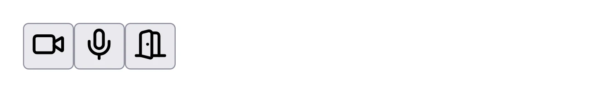

# How to customize the toolbar

## Creating a custom toolbar using the Whereby Browser SDK

Whereby's browser SDK makes it easy to add video calling to your web or mobile application. You can also use our [React hooks](https://docs.whereby.com/reference/react-hooks-reference) and components to create a fully-customized UI.

In this tutorial, we'll create a custom toolbar using our video call SDK, React, CSS, and SVG. Before we begin, you'll need a [Whereby Embedded](https://whereby.com/information/embedded) account.


You can get started on Whereby for free with 2,000 participant minutes each month — perfect for trying our features.


This tutorial assumes:

* You're familiar with JavaScript, React, Node, and either [npm](https://www.npmjs.com/) or [Yarn](https://yarnpkg.com/).
* You've already set up a React project. If not, [Vite](https://vitejs.dev/guide/) or [Parcel](https://parceljs.org/recipes/react/) can get you up-and-running quickly.

Before you begin, create a meeting room from your account dashboard or using Whereby's [REST API](https://docs.whereby.com/whereby-101/creating-and-deleting-rooms). Since this is a tutorial, it’s fine to create an unlocked room.

### What we’re creating

This tutorial will walk you through creating a custom toolbar similar to the one shown below. Icons are SVG images from the [Lucide](https://lucide.dev/) collection.

<figure><figcaption><p>Figure 1: The toolbar’s design.</p></figcaption></figure>

Once you've set up your React project, add the Whereby Browser SDK and Lucide. If you're using npm, type the following.

```bash
npm i @whereby.com/browser-sdk lucide-react
```

Yarn users: use `yarn add` to install both packages.

```bash
yarn add @whereby.com/browser-sdk lucide-react
```

Lucide icons are available as JSX components. It saves the step of making SVG icons compatible with JSX.

### Adding Whereby to your application

To add video calling to your application, you'll first need to add the`WherebyProvider` component. `WherebyProvider` ensures that all of your components have access to Whereby's internal state.

Update your `index.js` file and wrap your main component — `App` in this case — in `WherebyProvider`. Your code should resemble the example below.

```jsx
import React from 'react';
import { createRoot } from 'react-dom/client';
import App from './App';
import { WherebyProvider } from '@whereby.com/browser-sdk/react'

const root = document.getElementById('app');
const container = createRoot(root);
container.render(
  <WherebyProvider>
    <App />
  </WherebyProvider>
);
```


Whereby added `WherebyProvider` in version 3.0 of the SDK. This is a significant change from earlier versions. See our [migration guide](https://docs.whereby.com/reference/react-hooks-reference/guides-and-concepts/migrate-from-version-2.x-to-3) for more.


Add the URL of your meeting room as well. Pass it to App as a roomUrl prop.

```jsx
const ROOM_URL = 'https://<example>.whereby.com/9c72b1a0-5871-47fd-0000-xxxxxx';

const root = document.getElementById('app');
const container = createRoot(root);
container.render(
  <WherebyProvider>
    <App roomUrl={ROOM_URL} />
  </WherebyProvider>
);
```

### Connect to the meeting room

Use the SDK’s [`useRoomConnection`](https://docs.whereby.com/reference/react-hooks-reference/api-reference/useroomconnection) hook to connect to your room. This hook returns a [RoomConnectionOptions](https://docs.whereby.com/reference/react-hooks-reference/types#roomconnectionoptions) object containing three properties:

* `state`, an object that reflects the status and settings of the current room, including the call's participants;
* `events`, an event emitter object that fires in-room events as they're happening; and
* `actions`, an object representing the available actions in the room.

`useRoomConnection.actions` contains the methods you'll need to join the meeting, and create the toolbar controls.

```jsx
import React from 'react';
import {useRoomConnection, VideoView } from "@whereby.com/browser-sdk/react";
// Import the `VideoView` component as well, so that you can see yourself.
```

Invoke the `joinRoom` action from React's [useEffect](https://react.dev/reference/react/useEffect) hook.

```jsx
const App = ({roomUrl}) => {
  // Connect to the room
  const roomConnection = useRoomConnection(roomUrl, {
    localMediaOptions: {
      audio: true,
      video: true,
    }
  });

  const {state, actions} = roomConnection;
  const { joinRoom } = actions;

  React.useEffect(() => {
    joinRoom();
  }, []);

  return (
    <>
      {state.localParticipant &&
        <VideoView stream={state.localParticipant.stream} />
      }
      <div className="toolbar">
      </div>
    </>
  );
}
```

Your `App.jsx` file should look a bit like the code above. Now to create each button.

### Create your toolbar buttons

This toolbar needs three controls: one to toggle the user's camera, one to toggle the user's microphone, and one that allows the user to leave the meeting. Start with the `CameraToggle` component.

`CameraToggle` should include two buttons: one to turn the camera on, and one to turn the camera off. When clicked, it'll show or hide the appropriate button and turn the video stream on or off.

Import the `Video` and `VideoOff` components from `lucide-react`. Use the `button` element to create the controls.

```jsx
import React from 'react';
import { Video, VideoOff } from 'lucide-react';

const CameraToggle = ({action}) => {
  return (
    <>
      <button
        className="toolbar__button"
        type="button"
        title="Turn video off"
      >
        <Video />
      </button>

      <button
        className="toolbar__button"
        type="button"
        title="Turn video on"
      >
        <VideoOff />
      </button>
    </>
  );
}

export default CameraToggle;
```

To keep track of which button should be visible, you'll also need to manage state. Use the `React.useState()` hook to define a `hidden` property and set its initial value.

```jsx
const Camera = ({action}) => {
  const [hidden, setHidden] = React.useState(true);
  // ... return component body here.
}
```

### Connecting actions to buttons

`CameraToggle` expects an `action` prop, in this case, `toggleCamera`. Import `CameraToggle` into `App.jsx`, then set `toggleCamera` as the value of its `action` prop.

```jsx
/* App.jsx */
import React from 'react';
import CameraToggle from './CameraToggle';

//...

const {
  joinRoom,
  toggleCamera
} = actions;

//...

return (
  <>
    {localParticipant &&
      <VideoView stream={localParticipant.stream} />
    }
    <div className="toolbar">
      <CameraToggle action={toggleCamera} />
    </div>
  </>
);
//...
```

Now add an `onClick` handler to both buttons. Set the value of `hidden` and call the `toggleCamera` action. A `true` argument turns the camera on and `false` turns it off.

```jsx
/* CameraToggle.jsx */

//...
return (
  <>
    <button
      className="toolbar__button"
      type="button"
      aria-label="Turn camera off"
      onClick={() => {
        setHidden(false);
        action(false);
      }}
      hidden={!hidden}
    >
      <Video />
    </button>

    <button
      className="toolbar__button"
      type="button"
      aria-label="Turn camera on"
      onClick={() => {
        setHidden(true);
        action(true)
      }}
      hidden={hidden}
    >
      <VideoOff />
    </button>
  </>
);
```

Each time the participant clicks `CameraToggle`, they'll start or stop their video stream, and show or hide the appropriate button. Use the same technique to create a `MicrophoneToggle` component with the `toggleMicrophone` action.

### Allowing participants to leave

Creating a `Leave` component is much simpler. There's no need to manage state.

```jsx
import React from 'react';
import { DoorOpen } from 'lucide-react';

const Leave = ({action}) => {
  return (
    <button
      className="toolbar__button"
      type="button"
      title="Leave the meeting"
    >
      <DoorOpen />
    </button>
  );
}

export default Leave;
```

Don’t forget to add `MicrophoneToggle` and `Leave` to `App`. Your video and toolbar should resemble the image in Figure 2.

<figure><figcaption><p>Figure 2: The VideoView component and the toolbar before adding CSS.</p></figcaption></figure>

### Styling the toolbar

Add a `style.css` file to your project and import it into `App.jsx`.

```jsx
import React from 'react';
import { useRoomConnection, VideoView } from "@whereby.com/browser-sdk/react";

import CameraToggle from './CameraToggle';
import MicrophoneToggle from './MicrophoneToggle';
import Leave from './Leave';

import './style.css';
```

As designed, each toolbar button is circle-shaped. Buttons are centered within the toolbar and have an equal amount of space between them. [CSS Flexbox](https://developer.mozilla.org/en-US/docs/Web/CSS/CSS\_flexible\_box\_layout) works well for this. Add a `.toolbar` rule set for `style.css`.

```css
.toolbar {
  display: flex;
  justify-content: center;
  gap: 4rem;
	background: hsla(0, 50%, 100%, 0.5);
  backdrop-filter: blur(10px);
  border-radius: .5rem;
}
```

The toolbar should now look a bit like Figure 3.

<figure><figcaption><p>Figure 3</p></figcaption></figure>

Now let’s style the buttons themselves. Add a `.toolbar__button` ruleset to `style.css`. Combine it with `:not([hidden])` so that hidden buttons remain hidden. Using `display: flex` centers the icon within each button.

```css
.toolbar__button:not([hidden]) {
  display: flex;
  align-items: center;
  justify-content: center;
  inline-size: 4rem;
  block-size: 4rem;
  background: linear-gradient(45deg, #434D6F, #292F44);
  border-radius: 100rem;
  border: 0px;
  cursor: pointer;
}
```

Figure 4 shows the result.

<figure><figcaption><p>Figure 4: Toolbar buttons before SVG-specific styles.</p></figcaption></figure>

### Styling SVG

You're almost there! According to the toolbar's design, each icon should be a bit larger, with a thinner stroke, and off-white color. You can modify some SVG properties including `stroke` and `stroke-width` with CSS. Add another rule set to `style.css`.

```css
.toolbar__button {
  background: transparent;
  border: 0px;
  cursor: pointer;
  padding: 0;
  /* About 48 pixels when the root font size is 16px */
  inline-size: 3rem;
  block-size: 3rem;

  /* Equivalent to .toolbar__button svg */
  svg {
    inline-size: 100%;
    block-size: 100%;
    stroke: hsl(60, 55%, 95%);
    stroke-width: 1px;
  }
}
```

Now your toolbar is complete. In real-world applications, remember to add `:hover` and `:focus` styles to your buttons.

<figure><figcaption><p>Figure 5</p></figcaption></figure>

This tutorial walked you through a simple toolbar with a few features. You can, however, add additional controls. For example, the `startScreenshare()` [action](https://docs.whereby.com/reference/react-hooks-reference/api-reference/useroomconnection#actions) allows participants to share their screen with other attendees. You can also add buttons for meeting hosts that allow a host to mute or remove participants. Since all of Whereby’s meeting room controls are available as actions, you can make your toolbar as robust as you’d like.

> Written by [Tiffany Brown](https://whereby.com/blog/author-tiffany-brown/)
