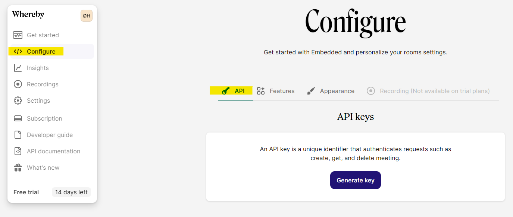
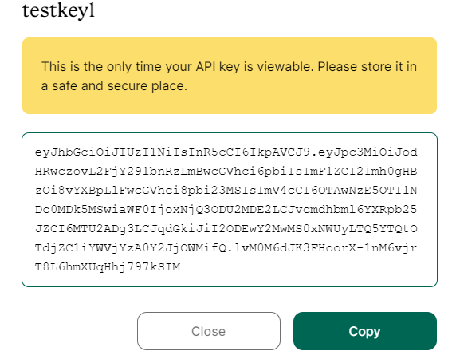
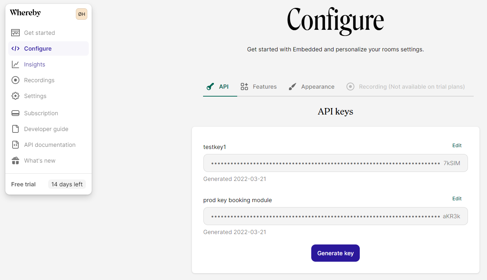

# Creating an API key

You can think of an API key as a way for a program or application to authenticate itself, much in the same way that user names and passwords work for humans. The API key is a long string of random characters acting both as a unique identifier and as the secret phrase needed for authentication.

1\. Get your API key by logging in to your Whereby Embedded account and open the "Configure" section of your dashboard:

2\. Give your API key a name, and click "Save" to view the API key in plain text:


Make sure to immediately copy the key to a secure location for safekeeping as it will only be displayed during creation, and you won't be able to retrieve it from the Embedded Dashboard at a later time.


Note that you can generate several API keys for the same Whereby Embedded account. This allows you to use different keys for different purposes, like having a separate key for a local development environment. This can be useful when deciding to shut down access for a particular integration, as you can then invalidate the API key used for that specific purpose without affecting integrations using other keys.

