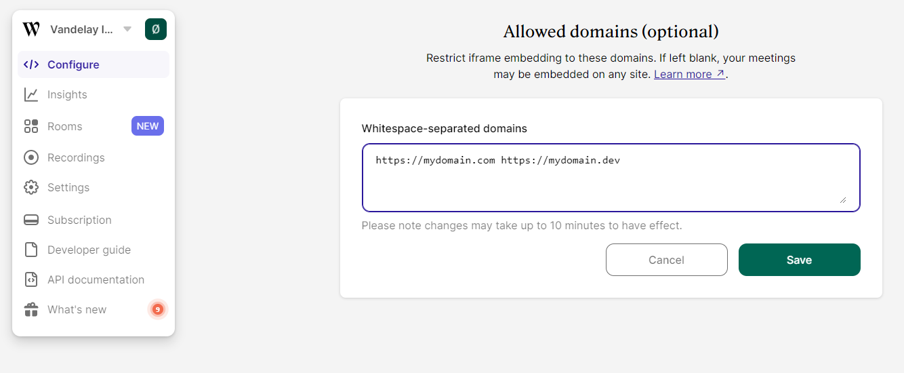

# Allowed domains

By default, Embedded meetings inside an iframe will load from any domain they are hosted in. If you want to limit which domains are allowed, go to your Embedded account dashboard and add them under “Allowed domains”:



Remember that you also have to allow `localhost` if you wish to test the iframe during development.

Please note that domains must be prefixed by `https://` (except `http://localhost`), and have no path. Wildcards to allow all subdomains under a domain are permitted, for example `https://*.domain.com`. If you are using another port than 443 for https, you need to include a line allowing it, for example `https://dev.domain.com:8080`.

Even if you're not specifically looking to restrict which domains can be used to embed your rooms, there are still some scenarios where you'll need to add your domains to this list:

1. **When using the \<whereby-embed> element for embedding.** If you're using the [\<whereby-embed>](../../create-your-video-experience-with-the-whereby-sdk/in-a-web-page/using-the-whereby-embed-element/) element for embedding rooms in your web page, you must add the origin of your application to the "Allowed domains" section to be able to send commands using the methods exposed by the element.&#x20;
2. **When using the `?avatarUrl=<url>` feature.** The domain used for hosting your avatars must be added to the "Allowed domains" list in order for the images to show up.


Note: Once you add your application origin domain or avatar URL domain to the "Allowed domains" list, you must also add any other domains that should be allowed to embed your rooms. This is needed since the default setting of allowing all domains will no longer be valid once a domain is added to the list, even if you added those domains for a different purpose.


### Verifying Domains

You can use a simple cURL command to review the allowed domains for your Whereby organization via the command line or terminal on your computer.

```
curl --head "https://<subdomain>.whereby.com/csp"
```

You can then review the results in the `content-security-policy` section
