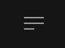
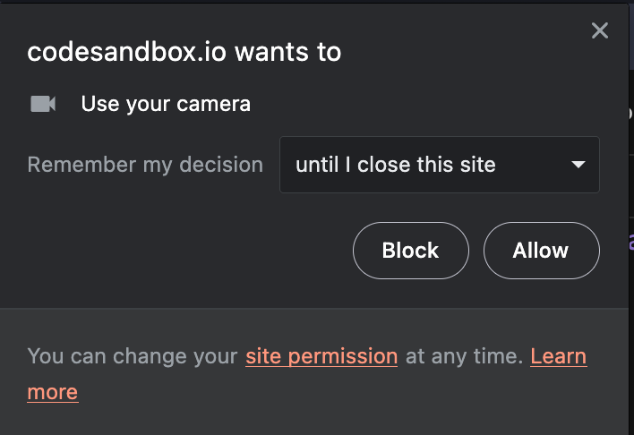
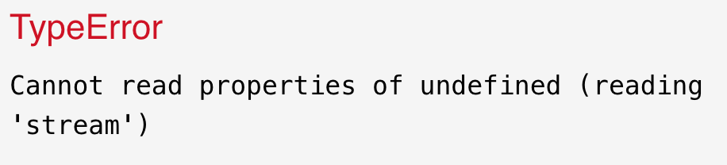
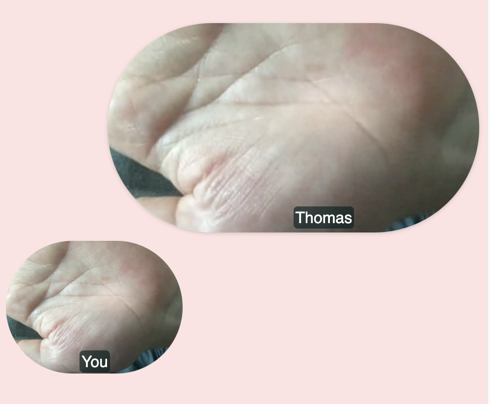
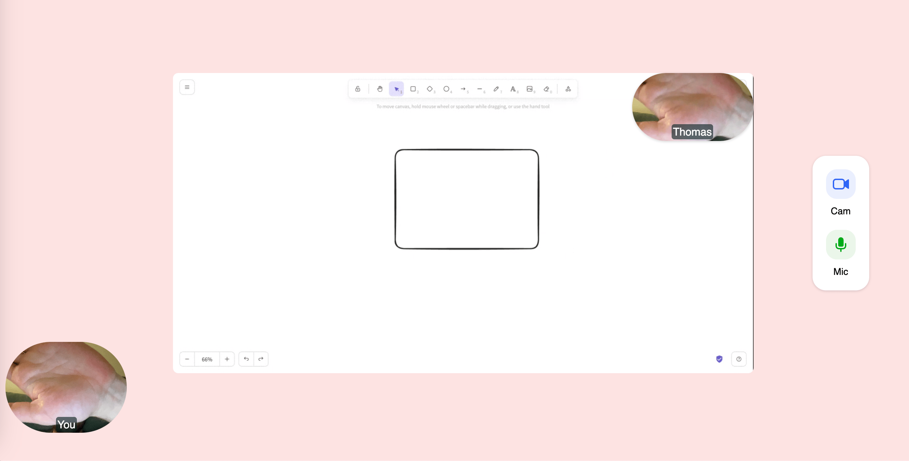

# Using Whereby React Hooks - Build a Telehealth app

### What are you building?

In this tutorial you will build a fully functional video-conferencing app using the Whereby browser SDK with React hooks. This sample app will connect two participants in a video chat with custom UI, which is the most common scenario in telehealth video solutions. The app will allow the participants to control their camera and microphone, share their screen and send chat messages.  &#x20;

Here is a preview of what you will achieve:

<figure><figcaption><p>Screenshot of the final app</p></figcaption></figure>


Codesandbox with the finished code.


Click **Open Sandbox** to run the code and see the result. (You will need to add your own room URL). The final code can also be found on [Github](https://github.com/whereby/browser-sdk/tree/development/examples/telehealth-tutorial-app).

## Setup for the tutorial

#### Create a Whereby room

You will need a Whereby Embedded account with a Whereby room to follow this tutorial. [Sign up for a free Embedded account here](https://whereby.com/org/signup/embedded?signupFlowPlanType=embedded\_free) or login to your existing account. Then create the room using a wizard available on the homepage of your Customer Portal or with the API request. [Learn more how to programatically create a Whereby room](https://docs.whereby.com/creating-and-deleting-rooms).

For this tutorial **make sure that your room is unlocked**, so that we don't have to implement the knock functionality.&#x20;

Copy the participant link to the room. In its most basic form, the room link has the following structure:

```
https://[subdomain].whereby.com/e5a4b3c2-8d1a-9f0e-7c6b-2d8f4e6a9db7
```

This will be your room URL, which you will need to later paste into the code.

#### Initiate the CodeSandbox

In this tutorial we're using CodeSandbox - an online web development environment, which lets you write the code in your browser and immediately preview how your users will see the app that you’ve created. In the live code editor below, click **Open Sandbox** in the bottom-right corner to open the editor in a new tab. You will see some text and the starter code of the project.


Codesandbox with the starter code.



**Note**

You can also follow this tutorial using your local development environment. To do this, you need to:

1. Install [Node.js](https://nodejs.org/en/)
2. In the CodeSandbox tab you opened earlier, press the top-left button  to open the menu and then choose **File > Export to ZIP** to download an archive of the files locally
3. Unzip the archive, then open a terminal and `cd` to the directory you unzipped
4. Change the ROOM\_URL constant in `App.tsx` to your own Whereby room URL.
5. Install the dependencies with `npm install` or `yarn install`
6. Run `npm start` or `yarn start` to start the development server


## Overview  <a href="#overview" id="overview"></a>

Now that you are set up, let's see how the Whereby browser SDK works.

### Inspecting the starter code  <a href="#inspecting-the-starter-code" id="inspecting-the-starter-code"></a>

The starter project does not include any code from the Whereby browser SDK. It's a React and TypeScript example project, but it has the SDK already installed as visible in the `package.json` file. We also added some CSS classes in the `styles.css` file and an `IconButton` component. These will be used throughout the tutorial. These have been added, so we can focus on the functionality of the SDK instead of styling. Take some time to look around and get familiar with the starter code before proceeding with the tutorial.

The `App.tsx` file is the main component in our project and is where we will be building our app.

### Connecting to the room

The first natural step is to connect to the room. When we connect to a room using the browser SDK, it is essentially the same as connecting to a standard Whereby room via a direct URL. Therefore, it is possible to run a session where some participants join the room from an app using the SDK client, while others use the regular Whereby room URL directly in the browser or embedded in another platform.

Initially, there is some disposable text in the `App.tsx` component. Let's remove it and add the `App` CSS class to the top div to achieve the following state:

```tsx
import "./styles.css";

export default function App() {
  return (
    <div className="App">
    </div>
  );
}
```

The browser SDK exposes a `useRoomConnection` React hook to connect to any Whereby room.  Let's import it to our app:

```tsx
import "./styles.css";
import { useRoomConnection } from "@whereby.com/browser-sdk";

export default function App() {
    //...
}
```

The `useRoomConnection` hook accepts two parameters: a Whereby room URL and a set of media constraints.&#x20;

For the Whereby room URL you need to provide the link to the unlocked Whereby room that you created initially. Declare it as a constant named `ROOM_URL`.

You can then use `localMediaConstraints` parameter to control the access to the camera and microphone of the meeting participant. Here, you can set the video and audio properties to `true` to allow the app access to both devices:

```tsx
import "./styles.css";
import { useRoomConnection } from "@whereby.com/browser-sdk";

// Put your room URL here.
const ROOM_URL = "";

export default function App() {
    const roomConnection = useRoomConnection(ROOM_URL, {
        localMediaConstraints: {
            audio: true,
            video: true,
        }
    });    
    
    return (
        <div className="App">
        </div>
    );  
}
```

Try saving the file. If your room URL is valid, you should see this prompt:

<figure><figcaption></figcaption></figure>

If you do, then congrats! Click "Allow", and you are now connected to your room. You can verify that you are connected by opening the room URL in a different tab. You should see a "Guest" user, which is the participant joining from the SDK.&#x20;

### Rendering your own video cell

Once we are connected to the room, we can begin rendering the video UI. A logical first step is to render our own video cell. The `useRoomConnection` hook consists of three main properties: `actions`, `components`, and `state`.\


#### `actions`

Actions consist of a set of functions that you can trigger inside a room, such as `toggleCamera`, `toggleMicrophone`, `startScreenshare`, `stopScreenshare`, `sendChatMessage`, and more. A full list of available actions can be [found in our docs](../../../reference/react-hooks-reference/useroomconnection.md#actions).

#### `components`

Components expose a `VideoView` component that can be used to render video cells. This is essentially a standard `<video />` element with additional properties to enhance the user experience.

#### `state`

This is the state of the provided room. Here you have access to your own video stream through the `localParticipant` object, as well as a list of remote participants in the `remoteParticipants` array. This is [also includes features](../../../reference/react-hooks-reference/useroomconnection.md#state) such as screenshare and cloud recording status.

***

Now let's use the functionality of the `useRoomConnection` hook to render our own video cell. We need the `VideoView` from `components` and the `localParticipant` from `state`.&#x20;


In this tutorial we use [destructuring](https://developer.mozilla.org/en-US/docs/Web/JavaScript/Reference/Operators/Destructuring\_assignment) syntax, but you can also access the properties in the following way:&#x20;

`const components = roomConnection.components`

Both of these approaches achieve the same result. The only difference is that with the latter, you have the flexibility to name the variable as you wish. However, for this tutorial we prefer destructuring as it makes the code more concise, especially when dealing with multiple properties.


First, capture the `components` property from `roomConnection` and store it in a variable. Next, create another variable to hold the `VideoView`. Then, integrate `VideoView` into the JSX element returned by our `App` component:

```tsx
//...

export default function App() {
  //...
  
  const { components } = roomConnection; 
  const { VideoView } = components;
  
  return (
    <div className="App">
      <VideoView />
    </div>
  );  
}
```

This won't actually render anything yet, as we don't have a stream to attach to the `VideoView`. This is where we need to pull in our `state` object and access the `localParticipant` property:

```tsx
//...

export default function App() {
  //...
  
  const { components, state } = roomConnection; 
  const { VideoView } = components;
  const { localParticipant } = state;
  
  return (
    <div className="App">
      <VideoView stream={localParticipant.stream} />
    </div>
  );  
}
```

If you run this code, you'll get the following error:

<figure><figcaption></figcaption></figure>

This happens because we are trying to access the `stream` property of the `localParticipant` before it is mounted. To resolve this, you can use conditional rendering of the `VideoView,` depending on the availability of `localParticipant.stream`. We should also mute the local audio, otherwise we will hear ourselves in the audio feedback loop.

```tsx
//...

export default function App() {
   //...
   
   const { components, state } = roomConnection; 
   const { VideoView } = components;
   const { localParticipant } = state;
   
   return (
      <div className="App">
         {localParticipant?.stream ? (
            <VideoView muted stream={localParticipant.stream} />
          ) : null}
      </div>
   );  
}
```

Now, you should be able to see your own video stream in your app. However, the video currently takes up the entire screen. To fix this, let's add some CSS.

In the project, there are already CSS classes available for use. First, we will add a wrapper `<div />` around the video view with a class named `left-section`. This wrapper will allow us to add more elements later and divide up the screen. Additionally, we will add another `<div />` around the video with a class called `self-view-wrapper`:

```tsx
//...

export default function App() {
  //...
    
  const { components, state } = roomConnection; 
  const { VideoView } = components;
  const { localParticipant } = state;
    
  return (
    <div className="App">
      <div className="left-section">
        {localParticipant?.stream ? (
          <div className="self-view-wrapper">
            <VideoView muted stream={localParticipant.stream} />
          </div>
        ) : null}
      </div>
    </div>
  );  
}
```

Now your video cell appears as an oval in the bottom left corner. Well done!

<figure><figcaption></figcaption></figure>

At this point, your code should look something like this:



### Rendering the remote participant(s)

It's cool that we can see our own video, but we can't have a meeting by ourselves. Let's render the videos of other participant(s) in the video call.

As mentioned before, we can access the remote participants through the `remoteParticipants` array on the `state` object. This array provides a list of all participants in the call (excluding ourselves) and allows us to access their display names and media streams, among other things.

The initial step is to render a video cell for each participant:

<pre class="language-tsx"><code class="lang-tsx"><strong>//...
</strong>
export default function App() {
  //...
    
  const { components, state } = roomConnection; 
  const { VideoView } = components;
  const { localParticipant, remoteParticipants } = state;
    
  return (
    &#x3C;div className="App">
      &#x3C;div className="left-section">
        {localParticipant?.stream ? (
          &#x3C;div className="self-view-wrapper">
            &#x3C;VideoView muted stream={localParticipant.stream} />
          &#x3C;/div>
        ) : null}
      &#x3C;/div>
      
      {remoteParticipants.map((participant) => (
        &#x3C;VideoView stream={participant.stream} />
      ))}
    &#x3C;/div>
  );  
}
</code></pre>

You can now see all the other participants in the room! Join the room from a separate browser, and you will see yourself twice - one small circle in the bottom left corner (The SDK self-view), and one big video. The big video represents the remote participant. If there are more people in the call, they will be displayed side-by-side.

As this tutorial is focused on a one-on-one telehealth meeting, we are only interested in **one** remote participant. Therefore, we will modify our code to only render the first participant.


The following process is **not** recommended for a real app, as there may still be other participants connected to the room and they will be hidden with this implementation.&#x20;

However, for the purpose of this tutorial, we will assume that there will only ever be two participants in the meeting.&#x20;


Let's update our code to only render one participant and add some classes. We will place the remote participant in a `<div />` that will have a class named `video-stage` and the `<VideoView />` will be wrapped in another `<div />` with a class named `remote-view-wrapper`:

```tsx
//...

export default function App() {
  //...
    
  const { components, state } = roomConnection; 
  const { VideoView } = components;
  const { localParticipant, remoteParticipants } = state;
    
  return (
    <div className="App">
      <div className="left-section">
        {localParticipant?.stream ? (
          <div className="self-view-wrapper">
            <VideoView muted stream={localParticipant.stream} />
          </div>
        ) : null}
      </div>
      
      <div className="video-stage">
        {remoteParticipants[0]?.stream ? (
          <div className="remote-view-wrapper">
            <VideoView stream={remoteParticipants[0].stream} />
          </div>
        ) : null}
      </div>
    </div>
  );  
}
```

Great! Now, the remote participant is visible in the center of the screen within an oval video cell.

<figure><figcaption></figcaption></figure>

### Adding the display name

To identify the participants during a conversation, we can add a label on the video cell displaying their names. We can achieve this by implementing a helper function that takes a participant's `id` as input. This function will return the participant's display name, or the string "Guest" if the display name is blank.

```tsx
//...

export default function App() {
  //...
    
  const { components, state } = roomConnection; 
  const { VideoView } = components;
  const { localParticipant, remoteParticipants } = state;
  
  function getDisplayName(id: string) {
    return remoteParticipants.find((p) => p.id === id)?.displayName || "Guest";
  }
    
  return (
    //...
  );  
}
```

For the local participant, there is no need to have a display name, so we can simply use the string "You". We will add a `<p />` tag with a class of `self-name`:

```tsx
//...

export default function App() {
  //...
    
  const { components, state } = roomConnection; 
  const { VideoView } = components;
  const { localParticipant, remoteParticipants } = state;
    
  return (
    <div className="App">
      <div className="left-section">
        {localParticipant?.stream ? (
          <div className="self-view-wrapper">
            <VideoView muted stream={localParticipant.stream} />
            <p className="self-name">You</p>
          </div>
        ) : null}
      </div>
      
      //...
    </div>
  );  
}
```

For the remote participant, we will add a `<p />` tag with the class `remote-name`, and use our newly created helper function `getDisplayName`:

<pre class="language-tsx"><code class="lang-tsx"><strong>//...
</strong>
export default function App() {
  //...
    
  const { components, state } = roomConnection; 
  const { VideoView } = components;
  const { localParticipant, remoteParticipants } = state;
    
  return (
    &#x3C;div className="App">
      //...
      
      &#x3C;div className="video-stage">
        {remoteParticipants[0]?.stream ? (
          &#x3C;div
            className="remote-view-wrapper"
          >
            &#x3C;VideoView stream={remoteParticipants[0].stream} />
            &#x3C;p className="remote-name">
              {getDisplayName(remoteParticipants[0].id)}
            &#x3C;/p>
          &#x3C;/div>
        ) : null}
    &#x3C;/div>
  );  
}
</code></pre>

Now we can see the name of the participants in the call!

<figure><figcaption></figcaption></figure>

### Adding in-room actions

Let's add some in-room actions. First, we'll add buttons to control the camera and microphone. To simplify the styling (and to keep this tutorial as short as possible!), we have already included a component called `<IconButton />` that can render the buttons. It has 3 variants: `camera | microphone | share`. Let's begin with the camera.&#x20;

The SDK provides a function called `toggleCamera` which accepts a single parameter `enabled: boolean`. We can use this function to control the state of our camera. To display a different button variant depending on whether the camera is enabled or disabled, we will use React's `useState` function to store this information in our local component's state:

```tsx
//...

export default function App() {
  const [isCameraActive, setIsCameraActive] = React.useState(true);
    
  //...
    
  return (
    //...
  );  
}
```

We set the default value to `true` because we join the room with the camera turned on by default. With this local state, we can now make use of the `toggleCamera` function on the `roomConnection`'s action object:

```tsx
//...

export default function App() {
  const [isCameraActive, setIsCameraActive] = React.useState(true);
  
  //...    
  const { components, state, actions } = roomConnection; 
  const { VideoView } = components;
  const { localParticipant, remoteParticipants } = state;
  const { toggleCamera } = actions;
    
  return (
    //...
  );  
}
```

Let's render the button. As mentioned earlier, we will use the `<IconButton />` component. In this case, we'll set the `variant` prop to `camera`. The `<IconButton />` component also has a propererty called `isActive`, which is a boolean value that determines whether to show the "on" or "off" version of the button. We can pass our newly created `isCameraActive` variable to this prop.&#x20;

The last prop is the `onClick` handler. Here, we need to do two things: change the value of our `isCameraActive` state variable to the opposite of its current value, and call the `toggleCamera` function to actually turn the camera on or off.&#x20;

To style this section, we'll add two divs. The first div will have a class name of `controls-wrapper` and will act as the outer wrapper. The second div, with the class name `buttons`, will hold our buttons. We'll place this code **after** the video stage (the remote video container):

<pre class="language-tsx"><code class="lang-tsx"><strong>//...
</strong>import IconButton from "./IconButton";

//...

export default function App() {
  //...
    
  const { components, state, actions } = roomConnection; 
  const { VideoView } = components;
  const { localParticipant, remoteParticipants } = state;
  const { toggleCamera } = actions;
    
  return (
    &#x3C;div className="App">
      //...
      
        &#x3C;div className="control-wrapper">
          &#x3C;div className="buttons">
            &#x3C;IconButton
              variant="camera"
              isActive={isCameraActive}
              onClick={() => {
                setIsCameraActive((prev) => !prev);
                toggleCamera();
              }}
            >
              Cam
            &#x3C;/IconButton>
          &#x3C;/div>
        &#x3C;/div>
    &#x3C;/div>
  );  
}
</code></pre>

Follow the same pattern for the microphone:

```tsx
//...

export default function App() {
  const [isCameraActive, setIsCameraActive] = React.useState(true);
  const [isMicrophoneActive, setIsMicrophoneActive] = React.useState(true);
  //...
    
  const { components, state, actions } = roomConnection; 
  const { VideoView } = components;
  const { localParticipant, remoteParticipants } = state;
  const { toggleCamera, toggleMicrophone } = actions;
    
  return (
    <div className="App">
      //...
      
        <div className="control-wrapper">
          <div className="buttons">
            <IconButton
              variant="camera"
              isActive={isCameraActive}
              onClick={() => {
                setIsCameraActive((prev) => !prev);
                toggleCamera();
              }}
            >
              Cam
            </IconButton>
            <IconButton
              variant="microphone"
              isActive={isMicrophoneActive}
              onClick={() => {
                setIsMicrophoneActive((prev) => !prev);
                toggleMicrophone();
              }}
            >
              Mic
            </IconButton>
          </div>
        </div>
    </div>
  );  
}
```

We now have two functional action buttons! Cool.

<figure><figcaption></figcaption></figure>

At this point, your code should look something like this:



### Screen sharing

We can now extend the functionality of the app with the ability to share the screen.

#### Remote screenshare

In this step we will display the screen shared by the remote participant. &#x20;

The SDK exposes the `screenshares` array within the `state` object of the `useRoomConnection` hook. This array includes the screenshare stream of both the local and remote participant. They can be distinguished using the `isLocal: boolean` prop. First, we need to destructure the `screenshares` prop from the `state` object. Then, render the first screenshare in the array, similar to how we did it for the remote participant video.&#x20;

We will wrap Add a class with the name of `screenshare-view-wrapper` in a div wrapping the `VideoView`.

Wrap the `VideoView` component in a `<div />` element with a class name of `screenshare-view-wrapper`:

```tsx
//...

export default function App() {
  //...
    
  const { components, state, actions } = roomConnection; 
  const { VideoView } = components;
  const { localParticipant, remoteParticipants, screenshares } = state;
  const { toggleCamera, toggleMicrophone } = actions;
  //...
    
  return (
    <div className="App">
      //...
      
      <div className="video-stage">
        //...
        {screenshares[0]?.stream ? (
          <div
            className="screenshare-view-wrapper"
          >
            <VideoView stream={screenshares[0].stream} />
          </div>
        ) : null}
        </div>
        //...
    </div>
  );  
}
```

To test the screen sharing functionality, open the room URL in a new browser tab, start a screenshare and return to your app. Currently, the screenshare appears directly below the remote participant's video. Our goal is to replace the remote video with the screenshare and move the remote video to the top-right corner of the shared screen. We have added CSS classes to achieve this, but we need to apply them conditionally.

Here is how we modify the rendering of the remote video view: if there are any active screenshares (`screenshares.length > 0`), add the class `remote-view-small` to the wrapper div. If there are no active screenshares, keep the existing `remote-view-wrapper` class.&#x20;

Similarly, for the remote display name add the class `screenshare-remote-name` if there are any active screenshares, and keep the `remote-name` class if there are none.

```tsx
//...

export default function App() {
  //...
    
  const { components, state, actions } = roomConnection; 
  const { VideoView } = components;
  const { localParticipant, remoteParticipants, screenshares } = state;
  const { toggleCamera, toggleMicrophone } = actions;
  //...
    
  return (
    <div className="App">
      //...
      
      <div className="video-stage">
        {remoteParticipants[0]?.stream ? (
          <div
            className={
              !screenshares.length ? "remote-view-wrapper" : "remote-view-small"
            }
          >
            <VideoView stream={remoteParticipants[0].stream} />
            <p
              className={
                !screenshares.length ? "remote-name" : "screenshare-remote-name"
              }
            >
              {getDisplayName(remoteParticipants[0].id)}
            </p>
          </div>
        ) : null}
        </div>
        //...
    </div>
  );  
}
```

As a result, the screen shared by the remote participant is centered and their video cell appears in the top-right corner:

<figure><figcaption></figcaption></figure>

#### Local screenshare

In this step we will enable local screen sharing from our app. The SDK provides two actions for this: `startScreenshare` and `stopScreenshare`. The implementation for local screen sharing will be very similar to the camera and microphone actions. We will keep track of the screenshare state by using the `useState` local component, with a default value of `false`. We will also desctructure the `startScreenshare` and `stopScreenshare` actions from the `actions` object, and then add an `IconButton` with a variant of `share`.&#x20;

```tsx
//...

export default function App() {
  const [isCameraActive, setIsCameraActive] = React.useState(true);
  const [isMicrophoneActive, setIsMicrophoneActive] = React.useState(true);
  const [
    isLocalScreenshareActive,
    setIsLocalScreenshareActive
  ] = React.useState(false);
    
  const { components, state, actions } = roomConnection; 
  const { VideoView } = components;
  const { localParticipant, remoteParticipants, screenshares } = state;
  const {
    toggleCamera,
    toggleMicrophone,
    startScreenshare,
    stopScreenshare
  } = actions;
    
  return (
    <div className="App">
      //...
      
        <div className="control-wrapper">
          <div className="buttons">
            //...
            <IconButton
              variant="share"
              isActive={isLocalScreenshareActive}
              onClick={() => {
                if (isLocalScreenshareActive) {
                  stopScreenshare();
                } else {
                  startScreenshare();
                }
                setIsLocalScreenshareActive((prev) => !prev);
              }}
            >
              {isLocalScreenshareActive ? "Stop" : "Share"}
            </IconButton>
          </div>
        </div>
    </div>
  );  
}
```

As a result we have a new action button, and we can start and stop sharing the screen from our app.&#x20;

### Chat

The last functionality that we will add to the app is the ability to exchange messages through a chat.&#x20;

#### Receiving chat messages

In the first step we will display the incoming messages in the app.

Similarly to other updates that take place in the room, the SDK exposes an array of chat messages within the `state` object. To begin, let's destructure this array and loop through the messages in the start of the `left-section` that we created earlier. Additionally, we will wrap all the messages with a `<div />` element using the `chat-wrapper` class.&#x20;

We can also utilize the previously defined helper function to retrieve the display name of the participant who sent the chat message. Each chat object includes a `senderId` field, which represents the participant's id. If the message is from ourselves, we can simply display "You" as the sender's name.

```tsx
//...

export default function App() {
  //...
    
  const { components, state, actions } = roomConnection; 
  const { VideoView } = components;
  const {
    localParticipant,
    remoteParticipants,
    screenshares,
    chatMessages
  } = state;
  const {
    toggleCamera,
    toggleMicrophone,
    startScreenshare,
    stopScreenshare
  } = actions;
    
  return (
    <div className="App">
      <div className="left-section">
        <div className="chat-wrapper">
          {chatMessages.map((msg) => (
            <>
              <p className="chat-message">{msg.text}</p>
              <p className="chat-message-name">
                {msg.senderId === localParticipant?.id
                  ? "You"
                  : getDisplayName(msg.senderId)}
              </p>
            </>
          ))}
        </div>
        //...
      </div>
      
      //...
    </div>
  );  
}       
```

Now we can see incoming chat messages. To test it, open the room URL in a new browser tab, and type some messages as the remote participant.&#x20;

#### Sending chat messages

To enable sending chat messages from our app, let's add an input field. The SDK provides an action called `sendChatMessage`, which takes a string as its only parameter. We will use this action to send chat messages to the room. To implement this, let's create a form and render it after the local participant in our HTML markup. We also need to keep track of the input values, so let's create a new local state called `text`:

```tsx
//...

export default function App() {
  //...
  const [text, setText] = React.useState("");
    
  const { components, state, actions } = roomConnection; 
  const { VideoView } = components;
  const {
    localParticipant,
    remoteParticipants,
    screenshares,
    chatMessages
  } = state;
  const {
    toggleCamera,
    toggleMicrophone,
    startScreenshare,
    stopScreenshare,
    sendChatMessage
  } = actions;
    
  return (
    <div className="App">
      <div className="left-section">
        //...
        <form
          className={"input-wrapper"}
          onSubmit={(e) => {
            e.preventDefault();
            sendChatMessage(text);
            setText("");
          }}
        >
          <input
            value={text}
            onChange={(e) => setText(e.target.value)}
            type="text"
            placeholder="Type here..."
          />
          <button type="submit">Send message</button>
        </form>
      </div>
      
      //...
    </div>
  );  
}
```

This enables us to send chat messages. However, you might notice a bug: whenever we type in the input field, the whole component re-renders, causing a flash on the video feeds. This happens because all the state is contained within the same component, causing it to re-render whenever a value changes. We can fix that easily by extracting the chat input in to a separate component. Let's create a new file called `ChatInput.tsx` and move the code there:

```tsx
// ChatInput.tsx
import * as React from "react";

function ChatInput({
  sendChatMessage
}: {
  sendChatMessage: (text: string) => void;
}) {
  const [text, setText] = React.useState("");

  return (
    <form
      className={"input-wrapper"}
      onSubmit={(e) => {
        e.preventDefault();
        sendChatMessage(text);
        setText("");
      }}
    >
      <input
        value={text}
        onChange={(e) => setText(e.target.value)}
        type="text"
        placeholder="Type here..."
      />
      <button type="submit">Send message</button>
    </form>
  );
}

export default ChatInput;
```

Now we can import this component into our app, and pass the `sendChatMessage` function as a prop. Remove all the code that we just added to `App.tsx`, and replace it with this:

```tsx
//...
import ChatInput from "./ChatInput";

export default function App() {
  //...
    
  const { components, state, actions } = roomConnection; 
  const { VideoView } = components;
  const {
    localParticipant,
    remoteParticipants,
    screenshares,
    chatMessages
  } = state;
  const {
    toggleCamera,
    toggleMicrophone,
    startScreenshare,
    stopScreenshare,
    sendChatMessage
  } = actions;
    
  return (
    <div className="App">
      <div className="left-section">
        //...
        <ChatInput sendChatMessage={sendChatMessage} />
      </div>
      
      //...
    </div>
  );  
}
```

Well done! We can now type chat messages without triggering re-renders. However, there are still re-renders whenever a new chat message is received or when the camera and microphone are turned on or off. These issues can be fixed using the same above approach.

### Conclusion&#x20;

Congrats! You have created a fully custom video app that:

* Connects to a Whereby room
* Acquires media permissions
* Renders the local video stream
* Renders the remote participant's video stream
* Renders screenshares
* Allows users to toggle their camera and microphone on and off
* Allows users to share their screen
* Shows chat messages as they come are received
* Allows users to send chat messages to other participants in the room

Great job! We hope this tutorial has given you a better understanding of how the React hooks in Whereby browser SDK work, and that you will continue to build with it.

The final code can be viewed here:



### Next steps

If you would like to continue working on this app, a good next step would be to separate things into components. This will help eliminate the re-rendering problems that we discussed.&#x20;

For example, you can create a `<Controls />` component to handle the buttons. This way, the app won't re-render when any of the buttons are clicked. Similarly, you can create a separate component for the chat, so that the app doesn't re-render whenever a new chat message comes in.&#x20;

lastly, it would be a good exercise to handle multiple remote participants or multiple screenshares.
