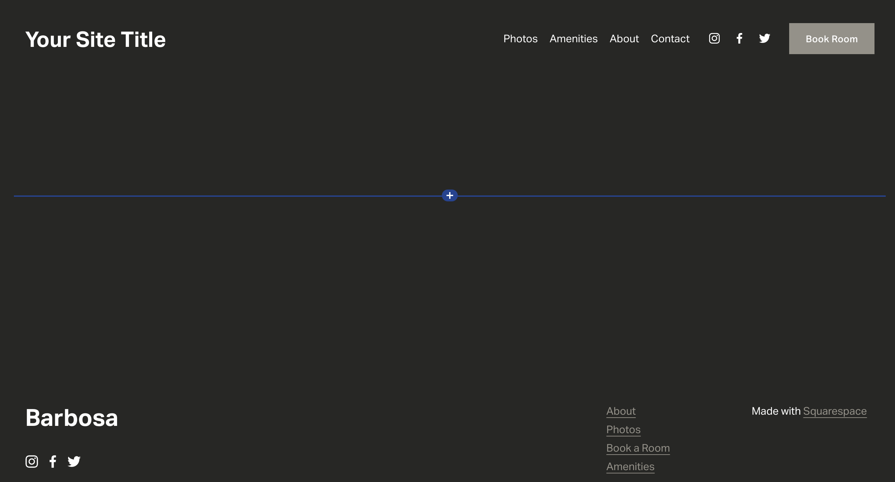
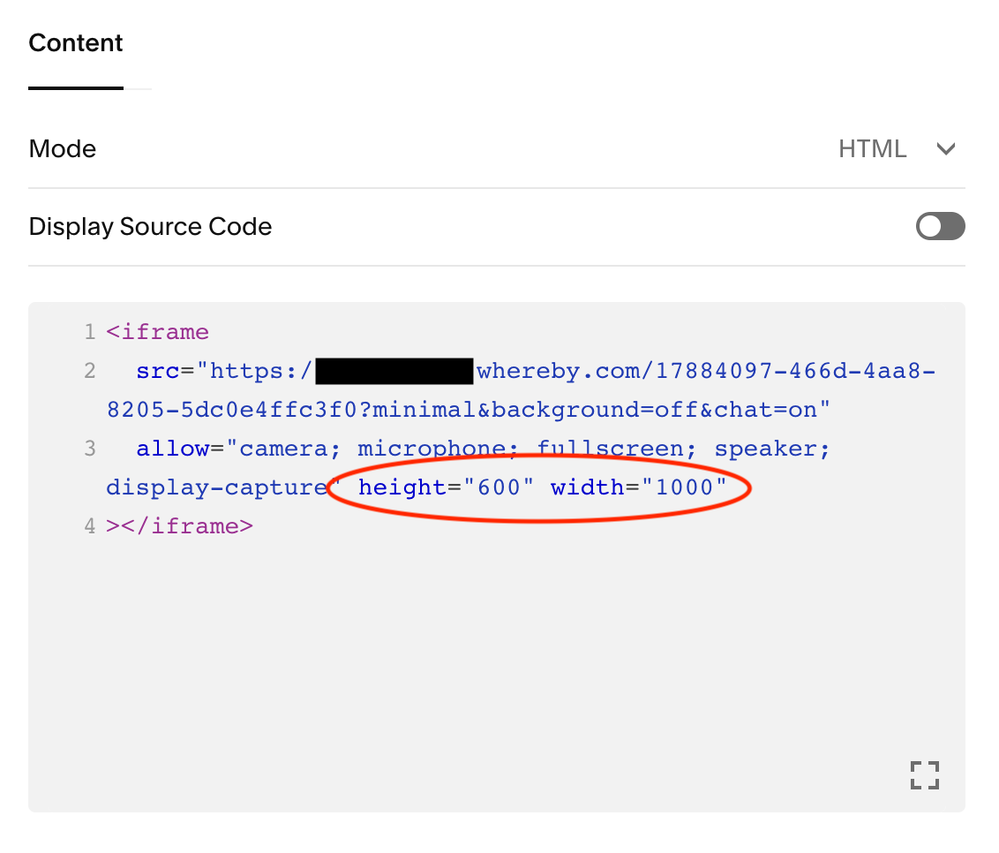
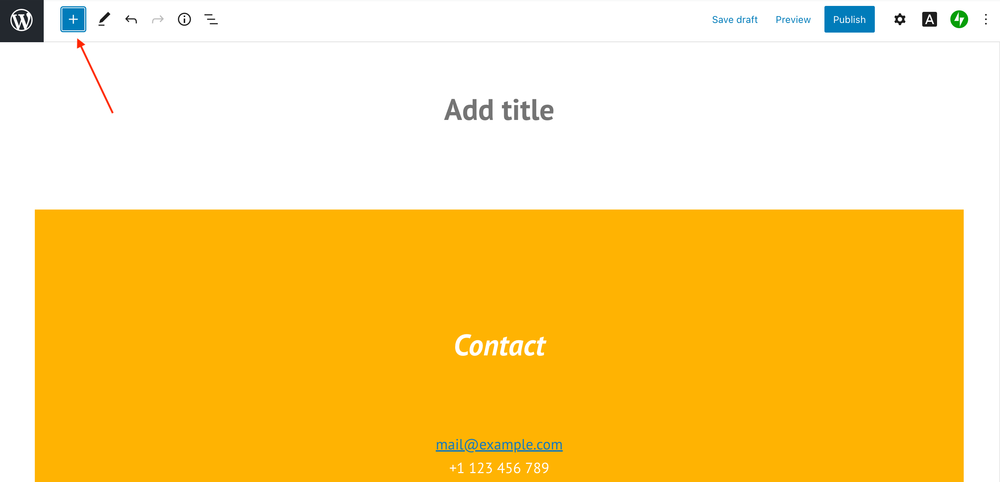
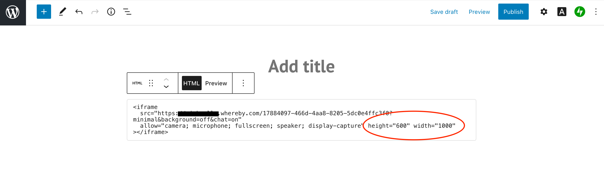

# Embedding in Squarespace or Wordpress


Due to technical limitations, you are not currently able to embed Whereby rooms within a Wix site.


## Squarespace

Squarespace allows for you to build simple and beautiful websites with ease. Below are the steps in order to embed Whereby on your site, but if you have additional questions about building your site please review [Squarespace Help Center](https://support.squarespace.com/hc/en-us).


**Note:** Adding iframes to a Code Block is a Premium feature available in Squarespace's current Website Business plan and higher.


**1** In the section you'd like to Embed Whereby, select the "+" to create a new block

<figure><figcaption></figcaption></figure>

**2** Select the "Code" option

<figure><figcaption></figcaption></figure>

**3** Enter in your iframe code into the block. You can see an [example iframe code here](./). You may need to include a height and width attribute to fit your site accordingly.

<figure><figcaption></figcaption></figure>

## Wordpress

Below are the steps in order to embed Whereby on your WordPress site, but if you have additional questions about building your site please review WordPress [**WordPress Help Center**](https://wordpress.com/support/).


HTML tags like script, iframe, form, input, and style are not available on Premium, Personal, or free plans. You need to upgrade to the [WordPress.com](http://wordpress.com) Business Plan and install a custom plugin or theme to use them.


**1** Select the "+" to create a new block

w

<figure><figcaption></figcaption></figure>

**2** In the search box, enter "code" and select the "Custom HTML" block

<figure><figcaption></figcaption></figure>

**3** Enter in your iframe code into the block. You can see an [example iframe code here](/broken/pages/f4AiIiksLiGW87XTTCeZ). You may need to include height and width attributes to fit your site accordingly.

<figure><figcaption></figcaption></figure>
