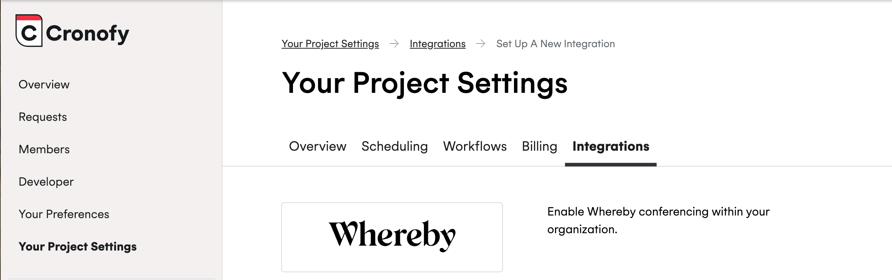

# Meeting scheduling with Cronofy

Whereby's API and SDK allow you to seamlessly embed video calling into your platform. Often times in order for a video call to take place, you need to schedule something between multiple various parties. Enter Cronofy:&#x20;

[Cronofy](https://www.cronofy.com/?utm_source=whereby\&utm_medium=docs) offers a robust, reliable, and powerful scheduling infrastructure. Now, it has a custom integration built just for Whereby.&#x20;


This feature is currently in beta and requires your Cronofy organization to be flagged for testing. If you would like to be a test user, please contact [support@cronofy.com](mailto:support@cronofy.com)\
\
You can create a Cronofy account [via their website](https://app.cronofy.com/sign_up/developer?utm_source=whereby\&utm_medium=docs)


## Whereby Setup

After [creating](https://whereby.com/information/embedded/select-plan?ref=select-product) your Whereby account, you'll need to create an API key:

1.  From the **Configure** section of the dashboard, select **Generate Key**<br>

    <figure><figcaption></figcaption></figure>
2. Name it what you'd like, and then make sure **copy** or save the value

## Cronofy Setup&#x20;

After receiving Beta access from Cronofy support and logging into your account, you'll need to enable and setup Whereby:

1. Select your **Organization Settings->Manage Integrations**
2.  Choose **Set Up New Integration**<br>

    <figure><figcaption></figcaption></figure>
3. Scroll and select Whereby
4. Input your Whereby API key and select **Save**
5. After saving your API key, check the boxes for the Cronofy apps/projects you'd like to use Whereby as a conferencing solution

### Creating events with Whereby

Cronofy has a complete [API reference available](https://docs.cronofy.com/developers/api/conferencing-services/create/?utm_source=whereby\&utm_medium=docs), below is the basics to get things working:

1. From the Whereby integration page, copy the `profile_id`
2. Use the `profile_id` in the `conferencing` object in an event creation request

```json
{
  "event_id": "cronofy-whereby-001",
  "summary": "Consultation with Dr R. Astley",
  "description": "We'll discuss what it means to never give up",
  "start": "2024-08-13T16:00:00Z",
  "end": "2024-08-13T17:00:00Z",
  "tzid": "America/Detroit",
  "conferencing": {
    "profile_id": "int_667c316c707e9e0a5ec87fe2_0000000000"
  }
}
```

Stay up to date with future features and how to use the Whereby integration via [their documentation](https://docs.cronofy.com/developers/api-alpha/whereby/?utm_source=whereby\&utm_medium=docs)!
