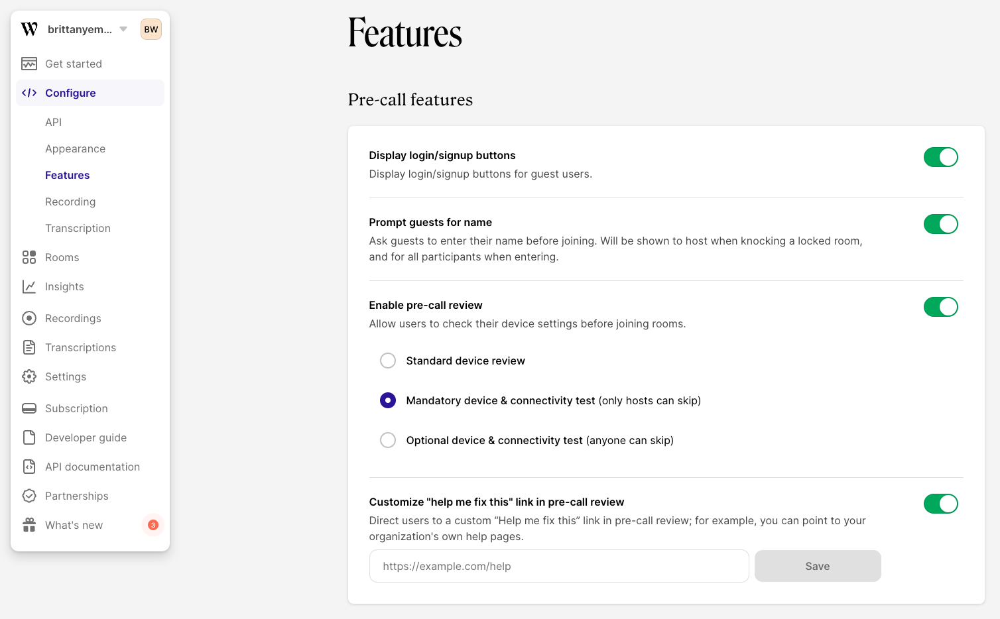
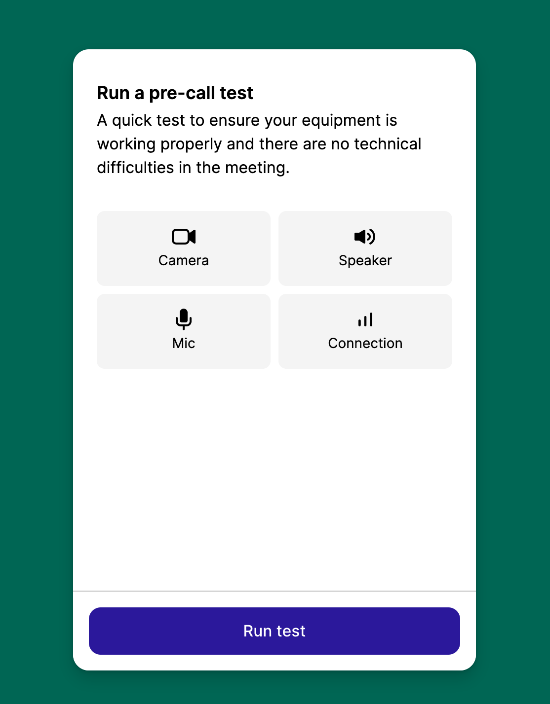
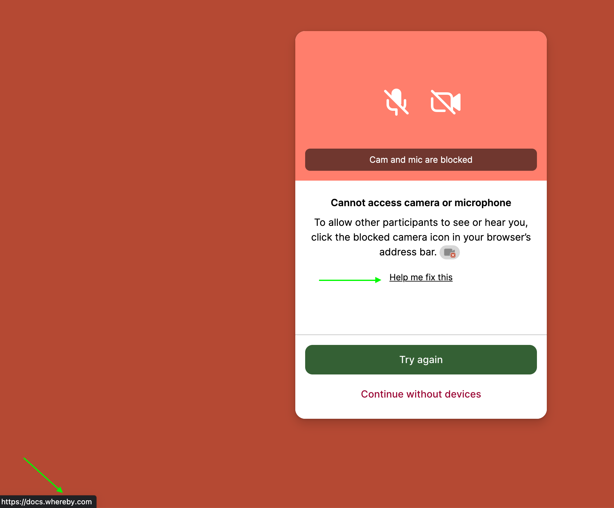

# Global preferences

The feature preferences can be found under "**Configure**” **→** “**Features**”. Any adjustments made here will be applied to all your rooms, unless overridden by specific [URL parameters](using-url-parameters.md) added to the meeting URL.

### Pre-call review

We provide waiting room options for your users to verify their device permissions and even test their internet connection in preparation for a call. By enabling pre-call review, you can specify if you'd like a simpler, single page standard review.&#x20;

Or, a dedicated test for each device including camera, microphone, and speakers, as well as a connectivity test. This can also be enabled for specific rooms with the [?precallCeremony parameter](using-url-parameters.md#precallceremony-less-than-on-or-off-greater-than).


The device and connectivity tests are a subset of the pre-call review feature. Pre-call review must be enabled in order for the `?precallCeremony` parameter or dashboard toggle to work.


<figure><figcaption></figcaption></figure>

### Help me fix this

You can add a custom link that appears when users accidentally block their permissions. This can be managed for all meetings via the dashboard, or set for individual meetings via our [URL parameter](using-url-parameters.md#precallpermissionhelplink-less-than-url-greater-than). If you need help building some support documentation we have some [End User Troubleshooting](../../end-user/end-user-support-guides/end-user-documentation.md) information that may prove helpful!

<figure><figcaption></figcaption></figure>

### Whereby Privacy Policy

From the Features tab, you can choose to remove the mention of Whereby's privacy policy during the pre-call portion. By checking the box you confirm that you have provided our policy by other means. You'll find our policy here:



