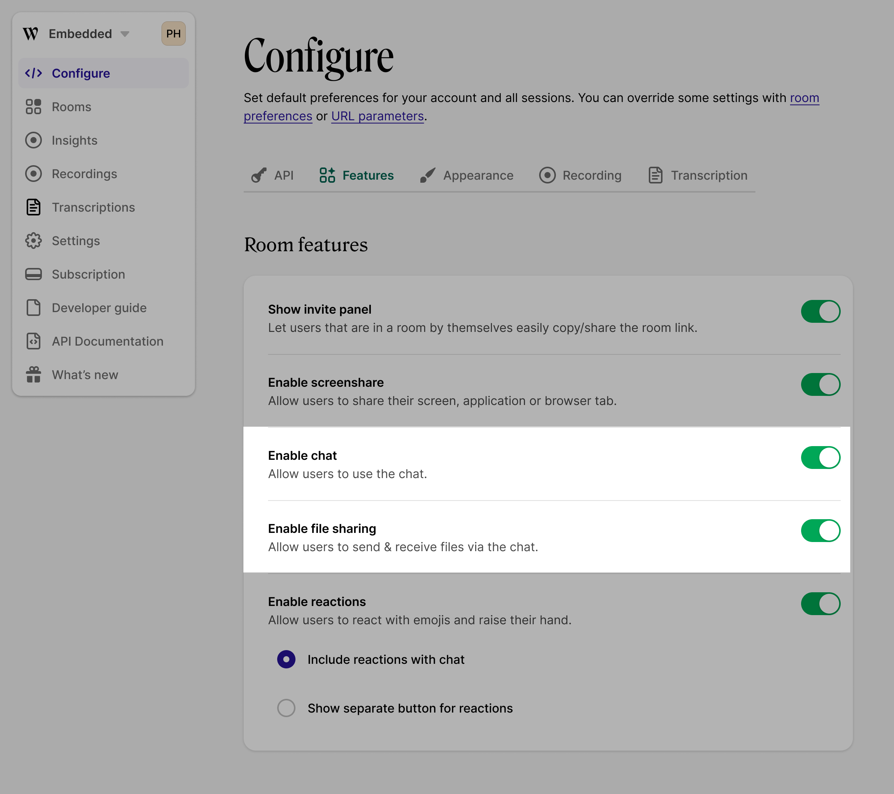

# File sharing


This feature is coming soon to all paid Whereby Embedded plans.


File sharing is a feature of Whereby's chat and allows all participants in a video session to exchange media files (images, documents, audio, and video) of up to 15 MB. Files are available for download throughout the session, making it easier to collaborate and share resources in real-time.


Files are available for download for the duration of the session only. All files are encrypted and securely stored in Whereby-managed cloud storage, and are **automatically deleted** within 1 minute from the end of the session. They are not backed up and cannot be retrieved after the session.


When file sharing is enabled, any session participant can share files from their computer, using a file picker or drag and drop into the chat. Each file is presented in the chat window as an individual message and all session participants can download them. Hosts are able to delete any file shared, removing any unnecessary or incorrect files to keep the session organised.

#### Supported file types

The following file types can be uploaded:

* **Images**: JPEG, PNG, GIF, WEBP
* **Documents**: PDF, DOCX, TXT, RTF, CSV, XLSX
* **Audio**: MP3, WAV
* **Video**: MP4, MOV, MKV, WEBM

#### Maximum file size

An individual file cannot exceed 15MB, which is sufficient for most documents and media while maintaining optimal session performance.

## Setup

By default, file sharing is enabled globally for your account and will be available in all sessions where chat is enabled. You can change the availability of file sharing globally or per room.

#### Global configuration

Go to the **Configure → Features** section of your dashboard to disable or enable file sharing for all your sessions.&#x20;


Chat must be enabled for file sharing to work. You can enable chat for all rooms on the dashboard or per room.


<figure><figcaption>
Global configuration of file sharing 
</figcaption></figure>

#### Per room configuration

You can override global configuration for individual rooms via the API during a [room creation](../../reference/whereby-rest-api-reference.md#create-meeting) request or with an [attribute or parameter](using-url-parameters.md) of `fileSharing=<on|off>`.

## Restrictions and Limitations

* Files can only be shared when there are at least two participants in the session, ensuring that the sharing feature is used for its intended collaborative purpose.
* File sharing is available in both room modes - P2P rooms called 'normal' and SFU rooms called 'group'. However please note, in both room modes the files being shared are temporarily stored in Whereby-managed cloud storage. [Learn more about P2P and SFU video sessions.](https://whereby.com/blog/p2p-vs-sfu-video-calls-which-is-best/)


File sharing is considered to be [HIPAA compliant](../faq-and-troubleshooting/hipaa-compliant-setup.md), as files are securely stored and only available to the participants for the duration of the session. All files are permanently deleted within 1 minute from the end of the session or from the moment when there is only 1 participant left in the room.&#x20;

