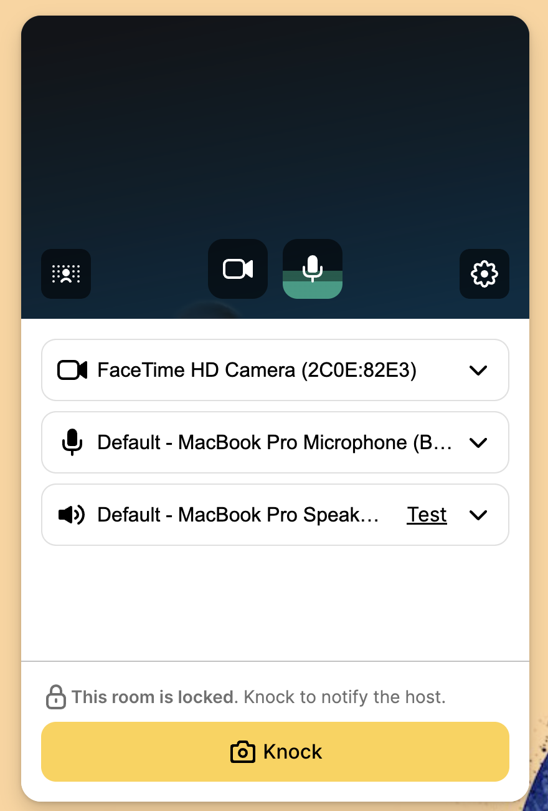
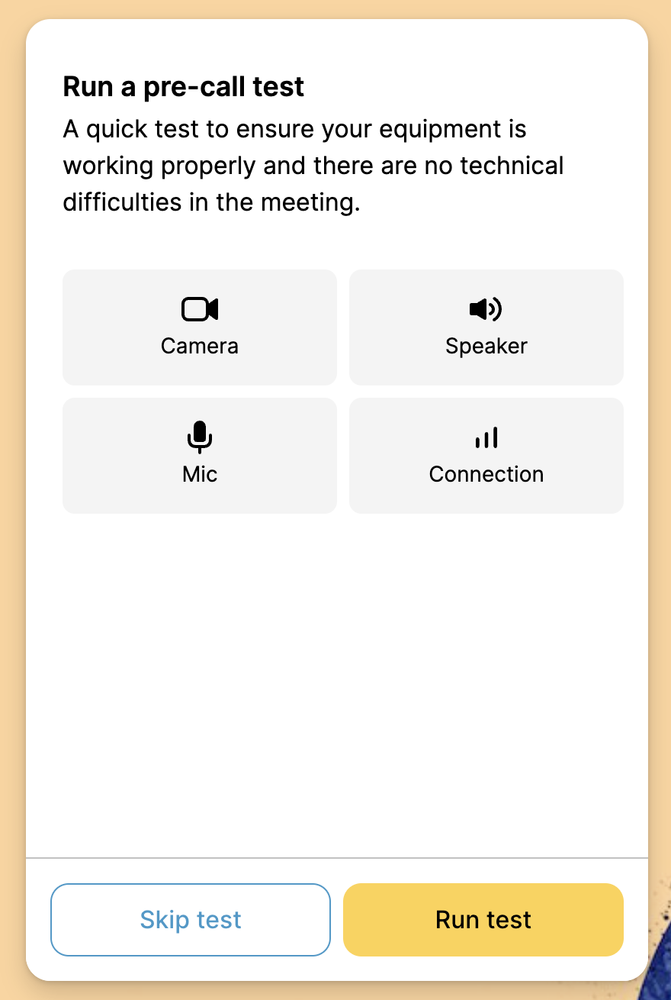
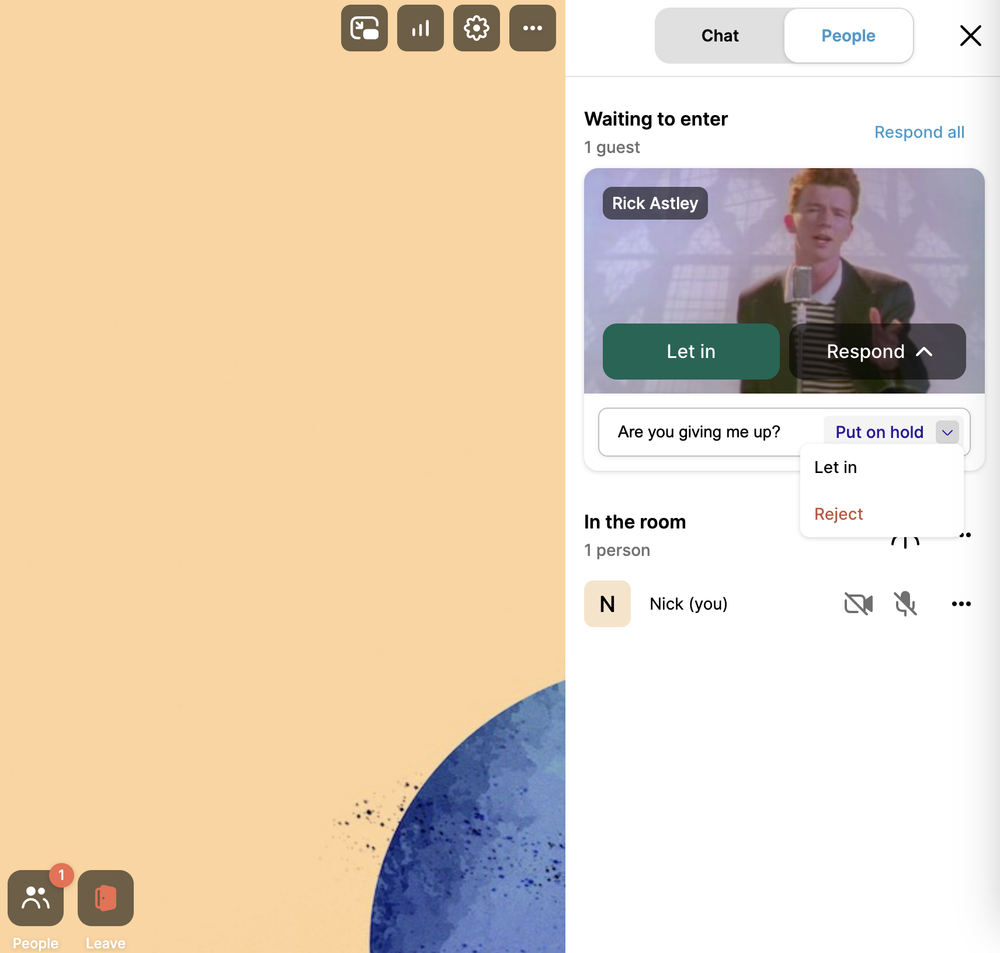
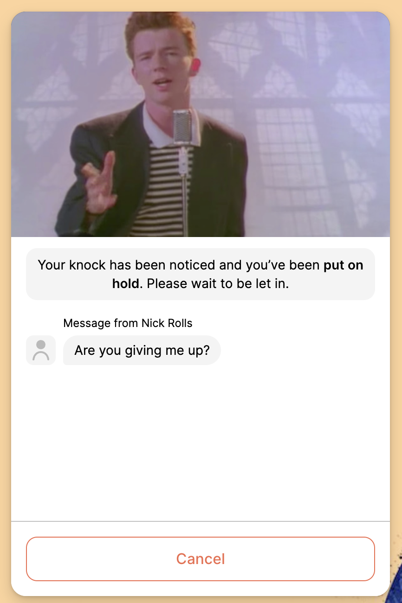

# Waiting Rooms

Waiting rooms are a great way for your hosts to manage meeting access with ease. Participants "knock" at the virtual door and hosts can allow entry, decline, or even said messages to communicate a delay.

You can create a waiting room experience for your participants by making sure the room is created as locked during the API request. You do this by setting the `isLocked` property to **true**:

<pre class="language-json" data-overflow="wrap"><code class="lang-json"><strong>// Example Request
</strong><strong>{
</strong>  "isLocked": true,
  "roomNamePrefix": "waiting-room-example-",
  "roomNamePattern": "uuid",
  "roomMode": "group",
  "endDate": "2024-07-05T18:10:34.695Z",
  "fields": [
    "hostRoomUrl"
  ]
}
</code></pre>


```json
// Example Response
{
  "startDate": "2024-06-21T18:10:35.056Z",
  "endDate": "2024-07-05T18:10:34.695Z",
  "roomName": "/waiting-room-example-546f6c91-74b2-4597-b32a-6aeefa9ed90f",
  "roomUrl": "https://subdomain.whereby.com/waiting-room-example-546f6c91-74b2-4597-b32a-6aeefa9ed90f",
  "meetingId": "87673375",
  "hostRoomUrl": "https://subdomain.whereby.com/waiting-room-example-546f6c91-74b2-4597-b32a-6aeefa9ed90f?roomKey=eyJhbGciOiJIU..."
}
```



Make sure to include a hostRoomUrl in the request. Users provided with a hostRoomUrl will have the ability to join a locked room, as well as accept and reject participants knocking at the room.


### Managing the waiting room experience

After you've created a locked room, there are a variety of ways you can customize the experience:

1. Choose the device review options that hosts and participants experience during the pre-call phase. We offer standard device reviews or full device and connectivity tests. These options can be  managed globally via [the dashboard](https://docs.whereby.com/whereby-101/customizing-rooms/dashboard-preferences#pre-call-review) or various [URL parameters](https://docs.whereby.com/whereby-101/customizing-rooms/using-url-parameters#precallceremonycanskip-on)\
   
2. Add a unique background image for the waiting room precall flow with our [API endpoint](../../reference/whereby-rest-api-reference/#rooms-roomname-theme-room-knock-page-background)

### User Experience

When a participant knocks at a locked room, hosts receive a notification in the room. They can they choose to "Put on hold" and include a message, "Let in", or "Reject":

<figure><figcaption><p>Host controls seen in the "People" tab</p></figcaption></figure>

Users are then notified from the host, or let into the room accordingly:

<figure><figcaption></figcaption></figure>
