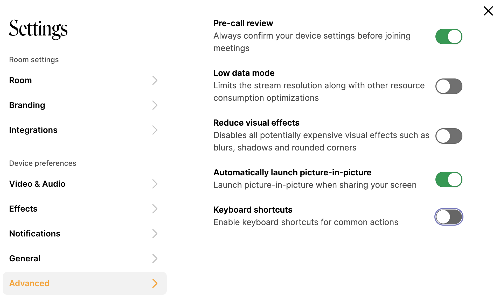

# Accessibility

For more informations and requirements for the 2.1 guideline, you can review the W3C site:



Download a copy of the latest Whereby Embedded VPAT:



### Features & Usage

#### Keyboard navigation

All parts of the Whereby UI are reachable using the **tab key**. Flyout menus can be triggered using the **space bar** (or a long press on mobile)

Users can also disable our single-key shortcuts if they prefer, as these might interfere with other shortcuts users have set.

<figure><figcaption>
Keyboard shortcuts toggle can be disabled in settings->advanced
</figcaption></figure>

#### Screen readers & Assistive Technology

Markup clearly defines the function of different UI elements and includes labels where needed, enhancing navigation for screen readers.

Aria-live attributes are used to define how screen readers should prioritise incoming chat messages and important status messages.

Viewport zooming restrictions are removed, allowing unrestricted zooming on mobile devices.
