# Global room customizations

The feature preferences can be found under "**Configure**” **→** “**Features**”. Any adjustments made here will be applied to all of your rooms, unless overridden by specific [URL parameters](../../whereby-for-web-browser/web-component-and-pre-built-ui/configuring-with-attributes.md) added to the meeting URL, or as query parameters in the API request when creating the meeting.&#x20;

## Pre-call features

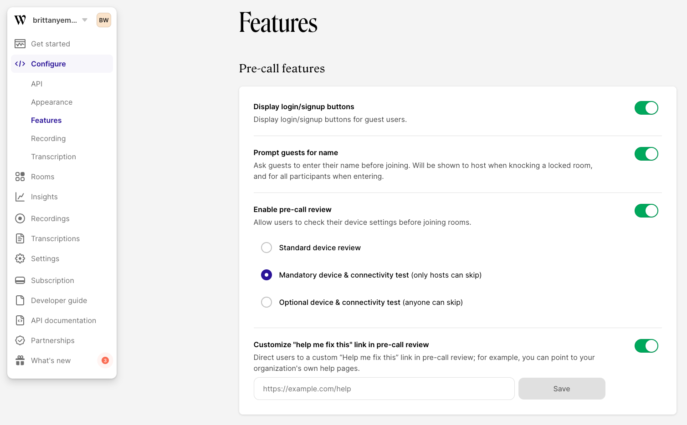

#### Display login/signup buttons

We provide a way for your users to log into their Whereby account (if they have one) or sign up for a Whereby account. Disabling these buttons is helpful in the case where you are embedding Whereby onto your own platform and want your own sign up and login options.&#x20;

<figure>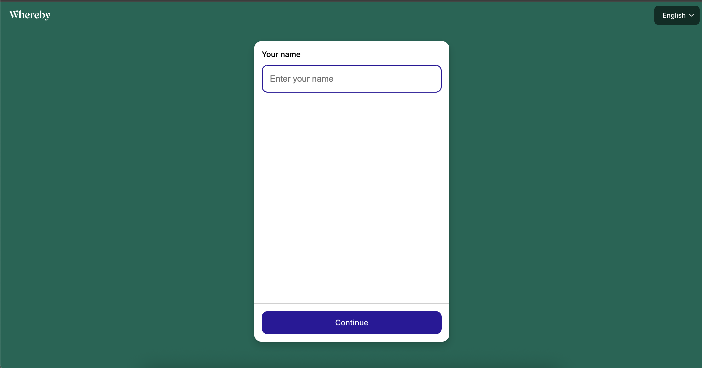<figcaption>
When this setting is disabled, no login or signup buttons appear
</figcaption></figure>

#### Ask guests for name

You can prompt guests to enter their name before joining a room. When the guest knocks on a locked room, the host will be able to see their name. The name will also be visible to all other participants upon entering. Disabling this feature will bypass the step to enter a name when opening a meeting link and will instead display in the room as **Guest**. This is helpful if you wish for all guests to be anonymized, or if you want to manually set the participant's name with the URL parameter `displayName=<name>`

<figure>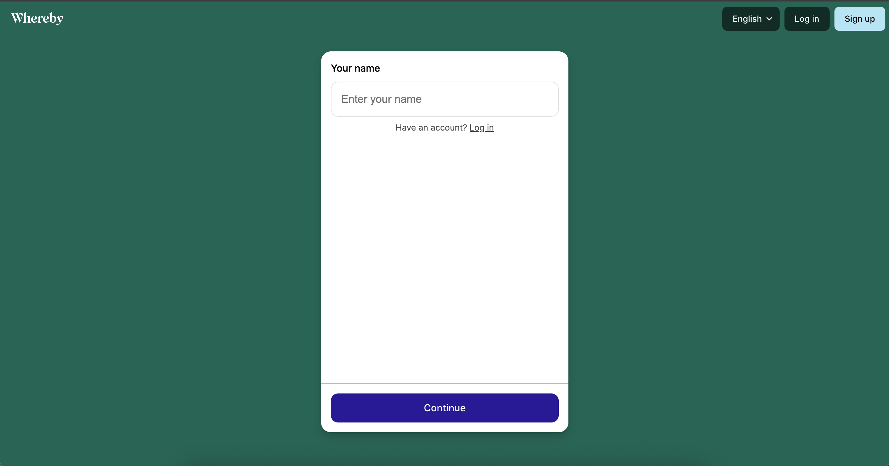<figcaption>
What it looks like when you enable this setting
</figcaption></figure>

#### Pre-call review

We provide waiting room options for your users to verify their device permissions and even test their internet connection in preparation for a call. By enabling pre-call review, you can specify if you'd like a simpler, single-page standard review.&#x20;

Or, a dedicated test for each device including camera, microphone, and speakers, as well as a connectivity test. This can also be enabled for specific rooms with the [?precallCeremony parameter](../../whereby-for-web-browser/web-component-and-pre-built-ui/configuring-with-attributes.md#precallceremony-less-than-on-or-off-greater-than).


The device and connectivity tests are a subset of the pre-call review feature. Pre-call review must be enabled in order for the `?precallCeremony` parameter or dashboard toggle to work.


<figure>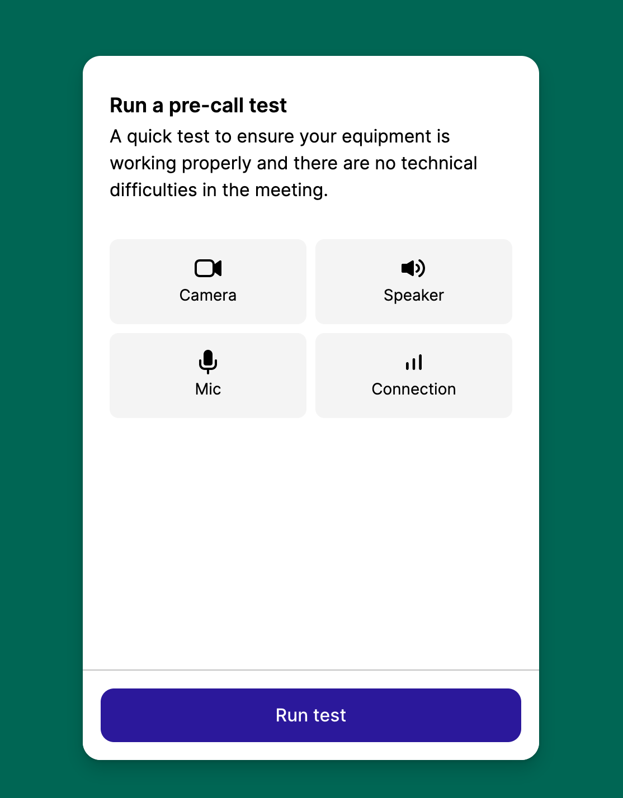<figcaption></figcaption></figure>

#### Help me fix this

You can add a custom link that appears when users accidentally block their permissions. This can be managed for all meetings via the dashboard, or set for individual meetings via our [URL parameter](../../whereby-for-web-browser/web-component-and-pre-built-ui/configuring-with-attributes.md#precallpermissionhelplink-less-than-url-greater-than). If you need help building some support documentation we have some [End User Troubleshooting](../../end-user/end-user-support-guides/end-user-documentation.md) information that may prove helpful!

<figure>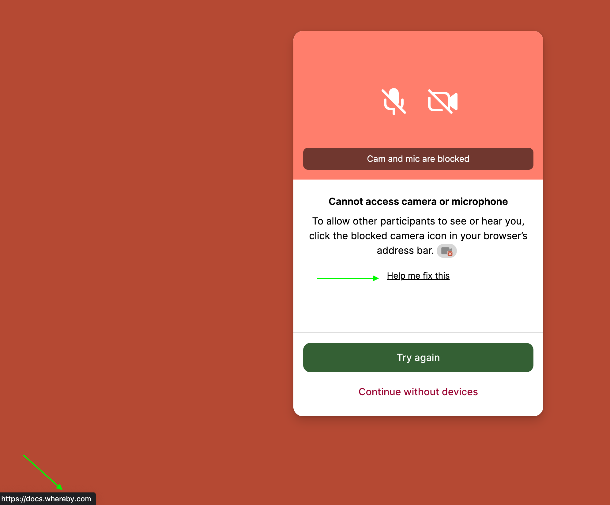<figcaption></figcaption></figure>

## Room Features

<figure>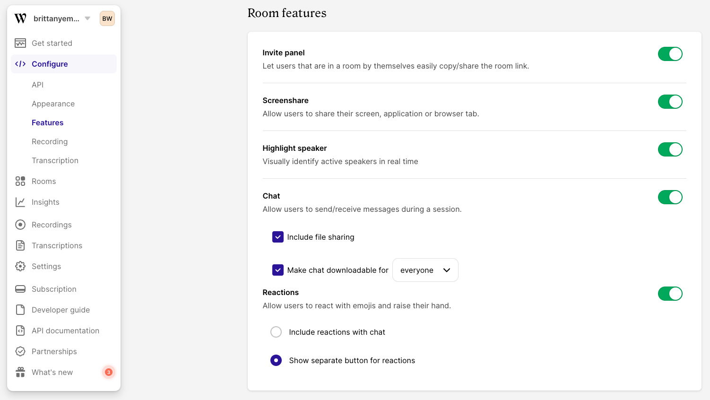<figcaption></figcaption></figure>

#### Invite panel

We provide an invitation panel that allows a user to copy and share the room link easily. This is visible when only one person is in the room. Having this enabled could be particularly helpful for ad hoc meetings, or inviting someone last minute. If meeting access needs to be limited or private, you may consider disabling this feature.&#x20;

<figure>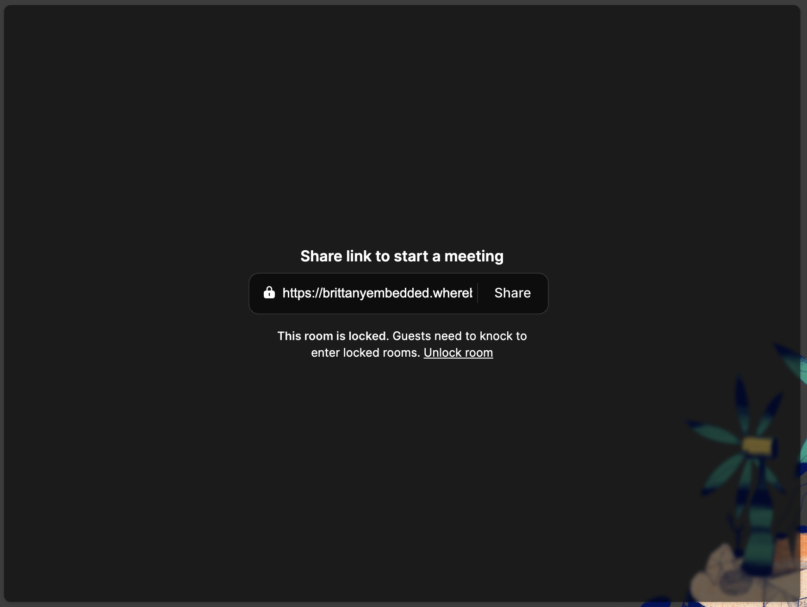<figcaption></figcaption></figure>

#### Screenshare

[Screen sharing](../screen-sharing.md) is a great way to share content to other hosts/participants in the room. Depending on the browser being used, there will be different options for what can be shared. You can enable (or disable) this globally across all rooms, or you can disable it on a per room link basis, like if you don't want participants to be able to screen share. This can be accomplished with the URL parameter `screenshare=off`

<figure>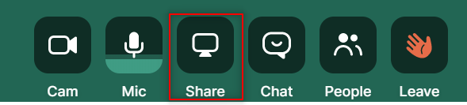<figcaption></figcaption></figure>

#### Highlight speaker

This feature detects and visually emphasizes the person currently speaking during video calls. This is disabled by default but can be enabled globally. This is great for larger group-sessions, where identifying who’s talking might be difficult. Alternatively, the URL parameter `highlightActiveSpeaker=<on|off>` toggles the feature at a room level.

<figure>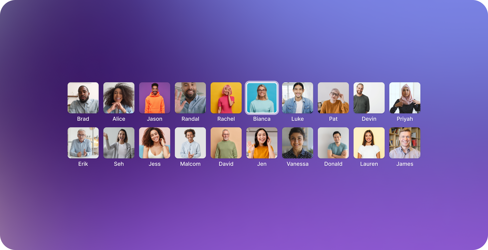<figcaption></figcaption></figure>

#### Chat

We allow users to send and receive messages within the meeting room. If this is disabled, then no written communication is available to meeting participants. This could be helpful in classroom settings or in a large webinar event.&#x20;

<figure>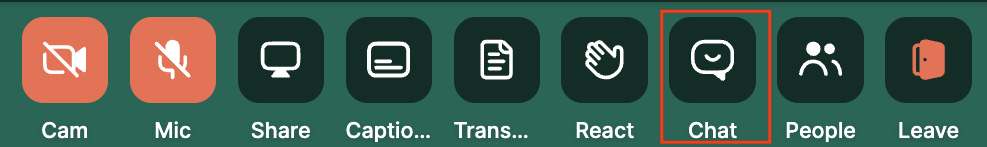<figcaption></figcaption></figure>

Within the chat feature, we provide a way for [**file sharing**](../file-sharing.md), which allows all participants in a video session to attach media files (images, documents, audio, and video). You can override global configuration for individual rooms via the API during a [room creation](https://docs.whereby.com/reference/whereby-rest-api-reference#create-meeting) request or with an [attribute or parameter](../../reference/using-the-whereby-embed-element.md) of `fileSharing=<on|off>`.


Chat must be enabled for file sharing to work. You can enable chat for all rooms on the dashboard or per room.


We also provide a way for the **chat to be downloadable**. Chat downloads allow users to save chat conversations, both during and after a session. You can choose to make this available to everyone, or only for the hosts. This is useful to have enabled for many use cases, like healthcare providers sharing treatment plans with patients. This is disabled by default but can be enabled globally. The URL parameter `chatDownload=<on|off>` toggles the feature at a room level.&#x20;


To be HIPAA compliant, '**Make chat downloadable**' should be toggled **off**, and you should not use the URL parameters to turn on chat export.


<figure>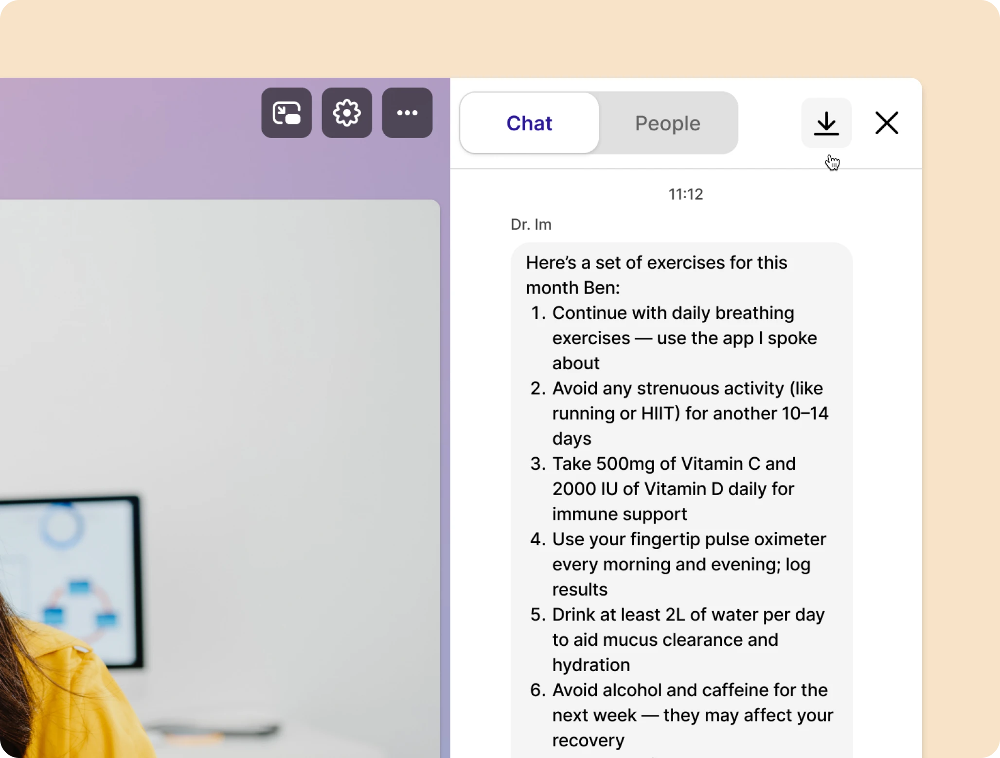<figcaption></figcaption></figure>

#### Reactions

We provide a way for guests to express their reactions to in-meeting happenings through the use of emojis. We also have a hand raise feature included to manage interruptions. In the global configuration, we allow for you to customize if you want the reactions feature to be condensed into one button with the Chat button, or to have it show as a separate button.  

When you include reactions with chat, they can be accessed by hovering over the Chat button. Some users want reactions separate so they can hide the Chat button — they don't want a chat function in their meetings, but they do want participants to feel engaged. We also provide an option to show a separate button for reactions.

<figure>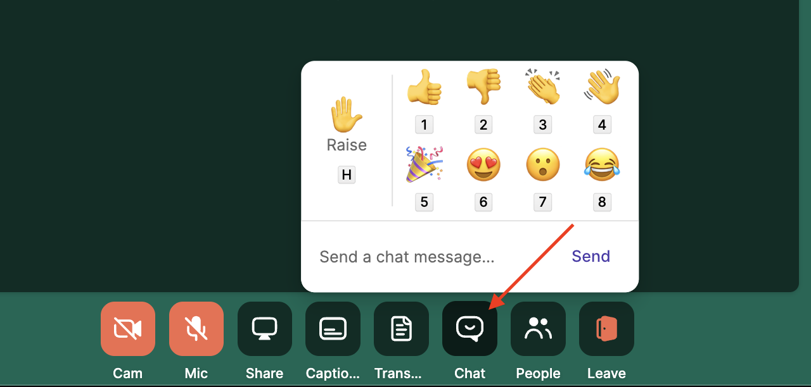<figcaption>
When you hover over the Chat button, reactions are displayed
</figcaption></figure>
