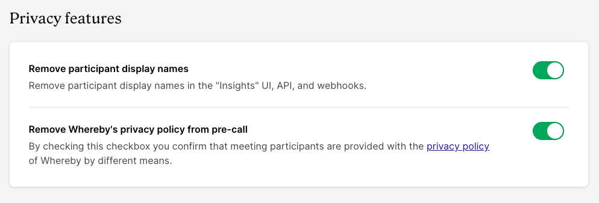
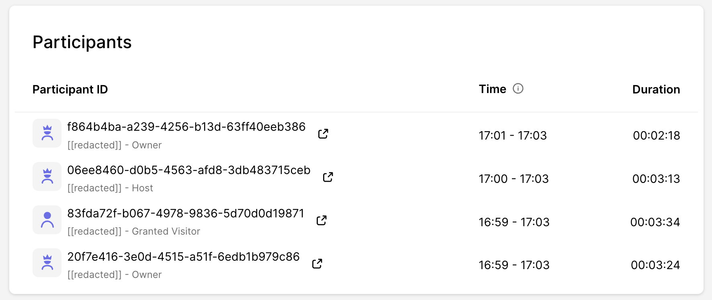

# Privacy Configurations

## Privacy features

**Privacy features** can be found in your dashboard, then navigating to "**Configure**"> "**Features**". At the bottom of this section, you will see the following:&#x20;

<figure><figcaption></figcaption></figure>

#### Remove display names

For maximum privacy, we allow users to remove display names in every area of the product. This includes the Insights Dashboard, in API responses, and webhooks. When enabled, the display name appears as `[[redacted]]`. This is perfect for those using Whereby in a telehealth capacity.&#x20;

<figure><figcaption></figcaption></figure>

#### Whereby Privacy Policy

You can choose to remove the mention of Whereby's privacy policy during the pre-call portion. By checking the box, you confirm that you have provided our policy by other means. You'll find our policy here:


